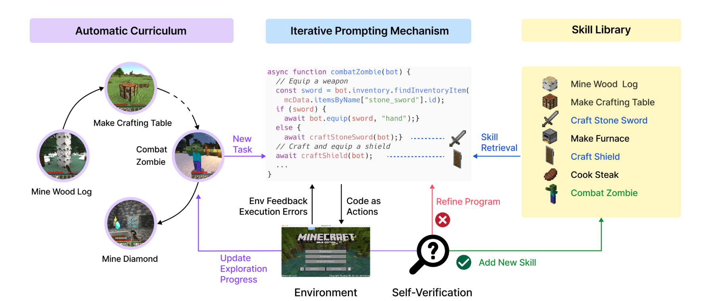
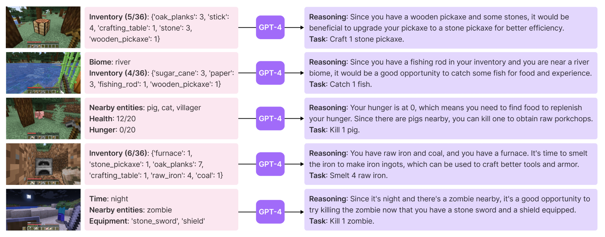
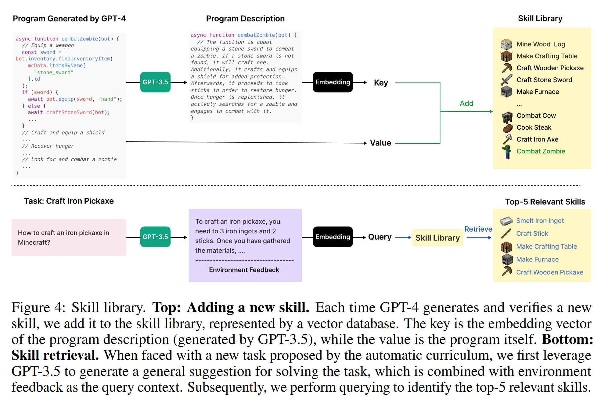
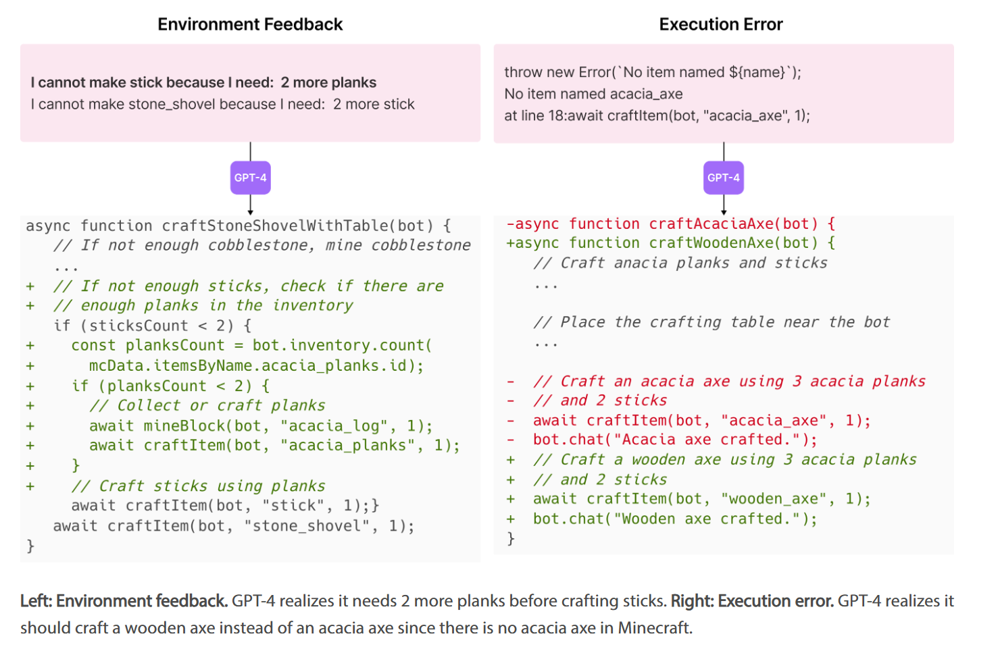
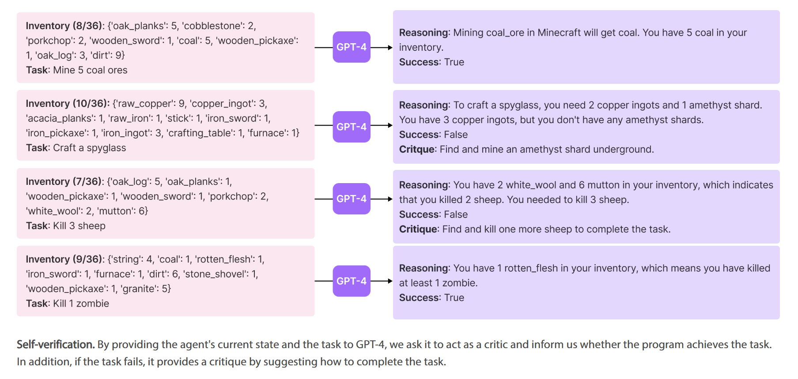
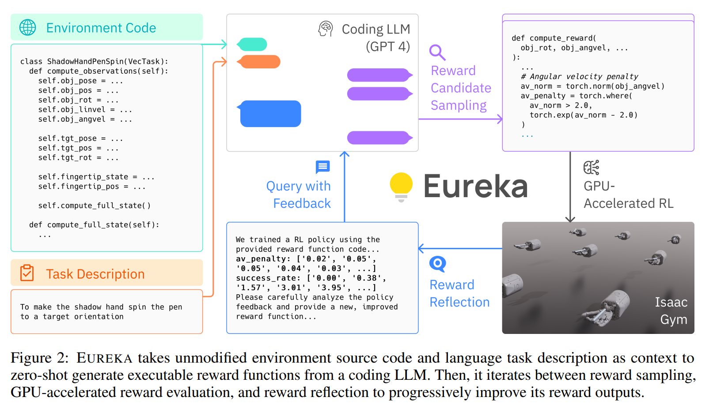

### Voyager: An Open-Ended Embodied Agent with Large Language Models

[Voyager: An Open-Ended Embodied Agent with Large Language Models](https://voyager.minedojo.org/)

- Use code as the action space instead of low-level motor commands because programs can naturally represent temporally extended and compositional actions.
- Interacts with a blackbox LLM (GPT-4) through prompting and in-context learning.
- Bypasses the need for model parameter access and explicit gradient-based training or finetuning.

- Automatic Curriculum: sugges objectives for open-ended exploration

  

  - The input prompt to GPT-4 consists of several components:
    - Directives encouraging diverse behaviors and imposing constraints, such as “My ultimate goal is to discover as many diverse things as possible... The next task should not be too hard since I may not have the necessary resources or have learned enough skills to complete it yet.”.
    - The agent’s current state, including inventory, equipment, nearby blocks and entities, biome, time, health and hunger bars, and position.
    - Previously completed and failed tasks, reflecting the agent’s current exploration progress and capabilities frontier.
    - Additional context: leverage GPT-3.5 to self-ask questions based on the agent’s current state and exploration progress and self-answer questions(budgetary considerations).

- Skill Library: develop increasingly complex behaviors

  

  - Each skill is indexed by the embedding of its description
  - When faced with a new task proposed by the automatic curriculum, perform querying to the skill library with the embedding of self-generated task
  plans and environment feedback to identify the top-5 relevant skills. Complex skills can be synthesized by composing simpler programs, which compounds Voyager's capabilities rapidly over time and alleviates catastrophic forgetting.

  - The input prompt to GPT-4 consists of the following components:
    - Guidelines for code generation, such as “Your function will be reused for building more complex functions. Therefore, you should make it generic and reusable.”.
    - Control primitive APIs, and relevant skills retrieved from the skill library, which are crucial for in-context learning to work well.
    - The generated code from the last round, environment feedback, execution errors, and critique, based on which GPT-4 can self-improve.
    - The agent’s current state, including inventory, equipment, nearby blocks and entities, biome, time, health and hunger bars, and position.
    - Chain-of-thought prompting to do reasoning before code generation.

- Iterative Prompting Mechanism: generate executable code for embodied control

  

  

  - Self-improvement through three types of feedback:
    - Environment feedback, which illustrates the intermediate progress of program execution. For example, “I cannot make an iron chestplate because I need: 7 more iron ingots” highlights the cause of failure in crafting an iron chestplate.
    - Execution errors from the program interpreter that reveal any invalid operations or syntax errors in programs, which are valuable for bug fixing.
    - Self-verification for checking task success. Instead of manually coding success checkers for each new task proposed by the automatic curriculum,instantiate another GPT-4 agent for self-verification. By providing VOYAGER’s current state and the task to GPT-4, ask it to act as a critic and inform us whether the program achieves the task. In addition, if the task fails, it provides a critique by suggesting how to complete the task.
  - During each round of code generation, execute the generated program to obtain environment feedback and execution errors from the code interpreter, which are incorporated into GPT-4’s prompt for the next round of code refinement.
  - This iterative process repeats until self-verification validates the task’s completion, at which point add this new skill to the skill library and ask the automatic curriculum for a new objective.

### Eureka: Human-Level Reward Design via Coding Large Language Models

[Eureka: Human-Level Reward Design via Coding Large Language Models](https://eureka-research.github.io/)

- Environment as Context
  - Directly uses the source code of the reinforcement learning environment and task description as input, leveraging the code comprehension capabilities of LLMs (e.g., GPT-4) to generate initial reward functions.
- Evolutionary Search
  - Several independent reward functions are sampled from the LLM. Contextual reward mutation is performed to generate new and improved reward functions from existing ones based on textual feedback. The generated reward functions are used to train reinforcement learning policies, evaluate candidate options, and record the performance metrics of the policies. The best-performing reward function is selected, and through multiple iterations, the quality of the reward function is gradually optimized.
- Reward Reflection
  - We can query the task fitness function F on the resulting policies, a simple strategy is to just provide this numerical score as the reward evaluation.
  - However,  the task fitness function itself lacks in credit assignment, providing no useful information on why a reward function works or not.
  - T rack the scalar values of all reward components at intermediate policy checkpoints throughout training and construct automated feedback that summarizes the policy training dynamics in texts.