### Large Scale Distributed Deep Networks

[Large Scale Distributed Deep Networks](https://dl.acm.org/doi/10.5555/2999134.2999271)

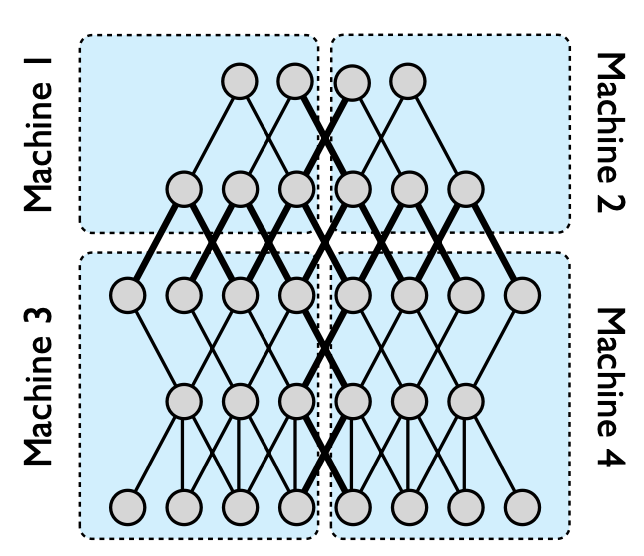

- Only thick lines (interconnections on different machines) need to communicate, and even if there are multiple edges between two nodes, the status is only sent once.
- Models with a large number of parameters or high computational requirements typically benefit from using more CPU and memory until communication costs dominate.
- Models with locally connected structures are often more suitable for a wide distribution than fully connected structures because their communication requirements are lower.

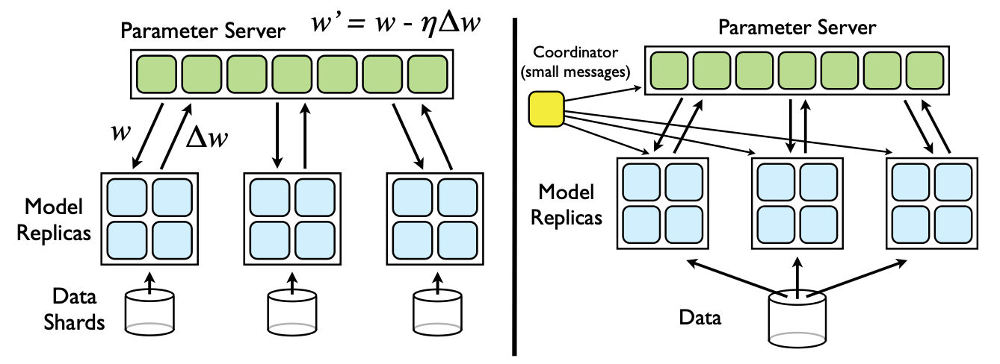

- Downpour SGD
  - Divide the training data into several subsets (Data Shards) and run a copy of the model on each subset.
  - The model updates and communicates through a centralized parameter server, which maintains the current state of all model parameters distributed across many machines (for example, if we have 10 parameter server shards, each shard is responsible for storing and applying updates up to 1/10 of the model parameters).
  - In the simplest implementation, before processing each small batch, the model copy will request an updated copy of its model parameters from the parameter server. Because the DistBelief model itself is distributed across multiple machines, each machine only needs to communicate with a subset of the parameter server shards that store the model parameters related to its partition. After receiving an updated copy of its parameters, the DistBelief model copy processes a small batch of data to calculate parameter gradients and sends the gradients to the parameter server, which then applies the gradients to the current values of the model parameters.
  - By limiting each model copy to only request parameter updates at every n_fetch step and only sending updated gradient values at every n_push step (which may not be equal), the communication overhead of Downpour SGD can be reduced.

- The model replica is almost certainly based on a slightly outdated set of parameters to calculate its gradient, as during this period, other model replicas may have already updated the parameters on the parameter server.
- Due to the independent operation of parameter server shards, it cannot be guaranteed that at any given time, the parameters of each shard of the parameter server have undergone the same number of updates, or that the updates are applied in the same order.
- The use of Adagrad adaptive learning rate program can greatly improve the robustness of Downpour SGD. Adagrad does not use a single fixed learning rate on the parameter server (η in Figure 2), but instead uses a separate adaptive learning rate for each parameter.

- Sandblaster L-BFGS
  - The core of optimization algorithms (such as L-BFGS) is located in the coordinator process, which cannot directly access model parameters. On the contrary, the coordinator issues a small set of operation commands (such as dot product, scaling, coefficient addition, multiplication), and each parameter server shard can independently perform these operations, with the results stored on the same shard without sending all parameters and gradients to a single central server.
  - In a typical L-BFGS parallelization implementation, data is distributed across many machines, each responsible for calculating the gradient of a specific dataset. The gradient is sent back to the central server (or aggregated through tree). Many of these methods are waiting for the slowest machine, resulting in poor scalability on large shared clusters.
  - To address this issue, we adopted the following load balancing scheme: the coordinator allocates a small portion of work to each of the N model replicas, which is much smaller than 1/N of the total batch size, and allocates new portions to the replicas when they are idle. Through this method, faster model replicas do more work than slower replicas. In order to further manage slow model replicas at the end of batch processing, the coordinator arranges multiple replicas of unfinished parts and uses the results of the first completed model replica.
  - Compared to Downpour SGD, which requires relatively high frequency and bandwidth for parameter synchronization with parameter servers, Sandblast workers only retrieve parameters at the beginning of each batch (when the coordinator updates parameters) and send the completed gradient portion every few times (to prevent replica failures and restarts)

### GPipe: Efficient Training of Giant Neural Networks using Pipeline Parallelism

[GPipe: Efficient Training of Giant Neural Networks using Pipeline Parallelism](https://arxiv.org/abs/1811.06965)

- Not applicable to graph neural networks.
- A neural network can be defined as a sequence of L layers, each layer corresponding to a forward calculation function f_i and a set of parameters w_i.
- Gpip allows users to specify (optional) the computational cost c_i for each layer, and to divide the network into K blocks, that is, L layers are divided into K subsequences, each subsequence is called a cell, and then the kth block is placed on the kth GPU.
- But it will generate a lot of bubbles, and the solution is similar to data parallelism, cutting the data apart.
- The mini batch is further divided into M micro batches, and gradients are applied to each micro batch. The overall idea is similar to fine-grained multithreading.
- There is no dependency between micro batches, so after GPU 0 completes the first few layers, let GPU 1 calculate the later layers, and then GPU 0 simultaneously calculates the first few layers of the next micro batch.

- The intermediate result/activation function result (z=wx) is related to the width of the hidden layer and the size of the sample size: O (n * d * l), n: size of mini batch, d:  Width, l:  Number of layers.
- Re-materialization / Active checkpoint: Each accelerator only maintains one cell and only stores the activation at the boundary, which is the input of each cell. N is the size of the sample size (input of each cell), L/K is how many layers each cell has, n/m is the size used for a micro batch in the current training process, and (L/K) * (N/M) is the memory used for intermediate values in the calculation process of each cell.
- Bubble gap time: O((k-1) / (m+k-1)) , k:  Pipeline length, how many GPUs, m:  Instruction length, how many micro batches.
- The longer the instruction length, the lower the cost. When is it cost-effective M >= 4k.
- The recalculation of the backward stage can start earlier without waiting for the gradient of the previous layer to return.
- Low communication overhead because only activation tensors are sent at the partition boundaries between accelerators.
- To ensure efficiency, partitioning requires that each GPU has a similar load, otherwise some GPUs are calculating while others are idle. Therefore, optimization is based on the previous user input c_i, or the model is run once to collect data for optimization.

### Megatron-LM: Training Multi-Billion Parameter Language Models Using Model Parallelism

[Megatron-LM: Training Multi-Billion Parameter Language Models Using Model Parallelism](https://arxiv.org/abs/1909.08053)

- Targeted on Transformer LLM. Tensor Parallelism.
- Partition MLP block:
  - It consists of two layers, and the overall operation can be expressed as σ(XA)B = Y.
  - The original input is 3-dimensional: Rows represent the batch size b. Columns represent the sequence length l. The depth axis represents the feature dimension k (or hidden layer width).
  - Here, the input is flattened into 2 dimensions: Rows represent b×l. Columns represent the feature dimension k.
  - Each GPU holds the complete input X.
  - The matrix A is split vertically, and each GPU computes a different block of XA.
  - The matrix B is split horizontally, and each GPU obtains a matrix of the same size as Y, but the result is partial.
  - Finally, an all-reduce operation is performed to obtain the complete Y.
  - During the process, each GPU holds different blocks of data. Only X (input) and Y (output) are duplicated across all GPUs.
  - Except for the beginning and the end, no communication is required during the intermediate steps.
  - One AllReduce in forward, one AllReduce in backward, the communication volume of one AllReduce is 2Φ. The total communication volume of MLP block is 4Φ.
- Partition Attention block:
  - Self-Attention Mechanism involves query (Q), key (K), and value (V). If there are k heads, then Q, K, and V are mapped to a matrix of size k/h. The attention score is computed between Q and K, then multiplied and summed with V to obtain a matrix of size k/h. Each head computes a k/h matrix, and the results from all heads are concatenated to form a matrix of size k. Finally, this is multiplied by a weight matrix W.
  - Parallelization Strategy is similar to MLP: The computation of each head is assigned to a different GPU. Each GPU holds only a portion of k. The output is split vertically, so W must be split horizontally. Each GPU computes a partial result of the same size as Y. An all-reduce operation is performed across all GPUs to obtain the complete result Y.
  - One AllReduce in forward, one AllReduce in backward. The total communication volume is 4Φ.
- Embedding Input Layer:
  - The input consists of batch size b and sequence length L. The vocabulary size is v, which represents the size of the dictionary. The input is used to look up a matrix of size b×L×k from the dictionary.
  - Parallelization Strategy: Since v (vocabulary size) is usually very large, it is split across multiple GPUs, with each GPU holding a portion of the vocabulary. During the lookup, if the token is found on a GPU, the corresponding embedding is retrieved, otherwise a value of 0 is returned. After the lookup, an all-reduce operation is performed, ensuring that each GPU obtains the complete result.

### Scaling Distributed Machine Learning with the Parameter Server

[Scaling Distributed Machine Learning with the Parameter Server](https://dl.acm.org/doi/10.5555/2685048.2685095)

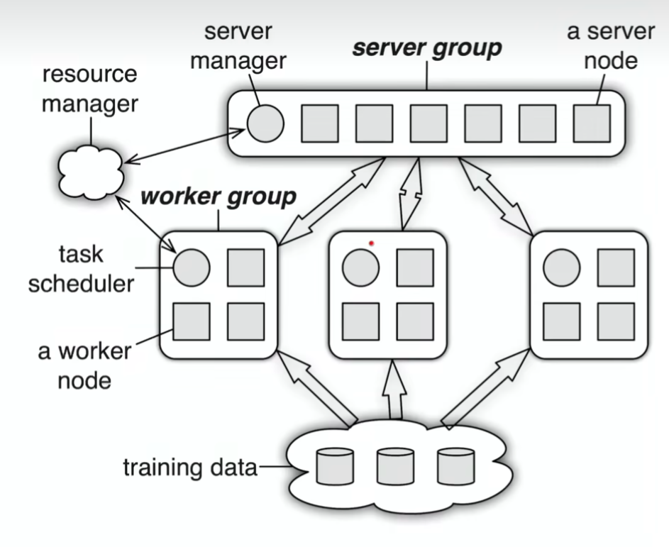

- Multiple Work Groups: Different tasks can be run simultaneously, such as training and online inference. The server just needs to have proper parameter version control.
- (Key, Value): Key: A value derived from the hash of the index of w. Value: A scalar or a vector (e.g., the weight w).
- Range-based Push and Pull: Specify an upper bound and a lower bound, and perform batched sending and receiving of the entire segment within that range.

- Asynchronous Execution and Synchronization:

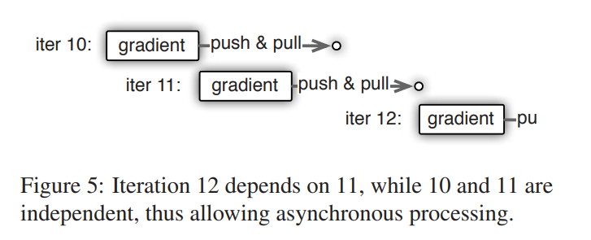

- Consistency Model: Reduces waiting time and improves system performance, but it may slow down model convergence.

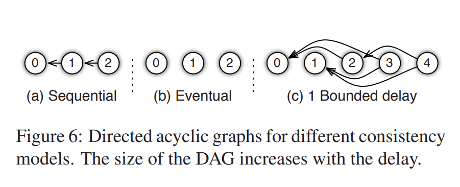

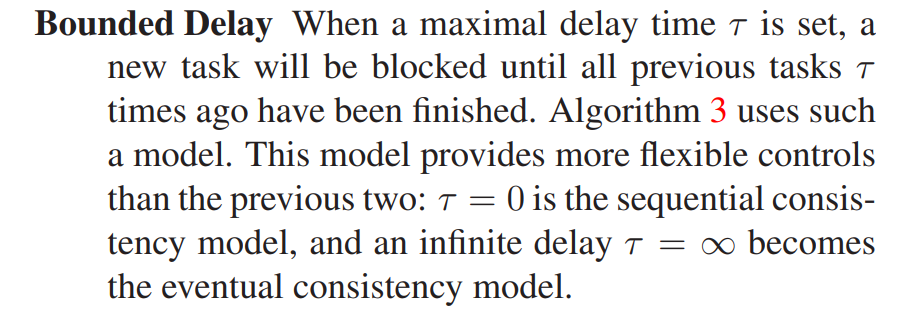

- User-defined Filter: Used to filter messages that need to be sent. Example: Significantly Modified Filter – Only items whose updates exceed a certain threshold will be sent.
- Vector Clock: The total parameter count multiplied by the total number of nodes results in a large size. Since key-value pairs are sent in ranges, it is sufficient to record the timestamp for each segment, which significantly reducing storage requirements.
- Communication: The server computes a hash for all keys. The client sends the hash of the keys it intends to transmit to the server. If the server finds a match, it can avoid resending the keys.
- Consistent Hashing:
  - All keys are organized into a ring, and segments are randomly inserted. Each segment is maintained by a server node (responsible for that range of keys). However, the keys from the next two segments are also backed up. This ensures that the system can tolerate the failure of up to two nodes during training. Nodes can be added or removed dynamically during runtime.

  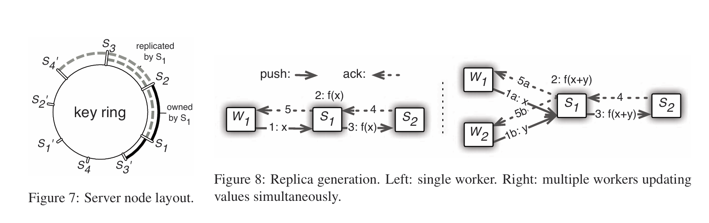

  - Consistency Guarantee: A worker sends parameters to Server1. After performing the operation, Server1 backs up the result to Server2. Server2 sends an acknowledgment (ack) back to Server1. Server1 then sends an ack to the worker.
  - Bandwidth Optimization: Server1 aggregates values from all workers first, then backs up the aggregated result to Server2. This reduces bandwidth usage but increases latency.
- Worker Fault Tolerance: If the scheduler detects that a worker has failed, it reassigns the task to another worker or requests a new worker. Since no state is saved, the failure of a worker is not a critical issue.

### ZeRO: Memory Optimizations toward Training Trillion Parameter Models

[ZeRO: Memory Optimizations toward Training Trillion Parameter Models](https://arxiv.org/abs/1910.02054)

- Model states: model parameters (fp16), gradients (fp16), and Adam states (fp32 parameter backup, fp32 momentum and fp32 variance). Assuming model parameters is Φ, the total memory requirement is: 2Φ + 2Φ + (4Φ + 4Φ + 4Φ) = 16Φ B. The Adam states accounts for 75%.
- Residual states: Memory usage other than model states, including activation, temporary buffers and unusable video memory fragmentation.
- Optimizing model states (removing redundancy), ZeRO uses partitioning, which means that each card only stores 1 / N of the model state, so that only one model state is maintained in the system.
- ZERO-1 (partition Adam states P_os (optimizer states)):
  - parameters and gradients are still kept one copy per card.
  - the required video memory for the model state of each card is (4Φ + 12Φ / N) B. When N is relatively large, it tends to be 4Φ B, which is the (1/4) of the original 16Φ B.

  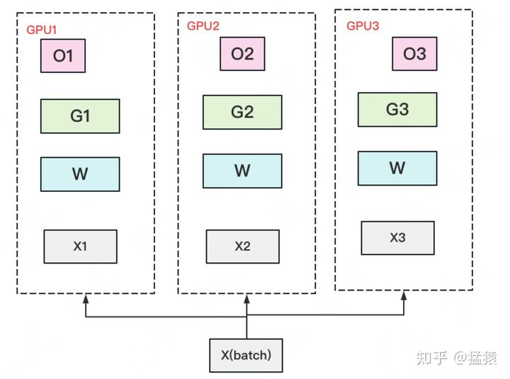

  - A complete copy of parameter W is stored on each GPU. A batch of data is divided into 3 parts, each GPU gets one part, and after completing a round of foward and backward, each gets a part of gradient.
  - Perform AllReduce on the gradient to obtain the complete gradient G, generating a communication volume of 2Φ per GPU.
  - Once the complete gradient G is obtained, W can be updated. We know that the update of W is determined by both optimizer states and gradients. Due to only storing a portion of optimizer states on each GPU, only the corresponding W (blue part) can be updated. (2) (3) can be represented by the following image:

  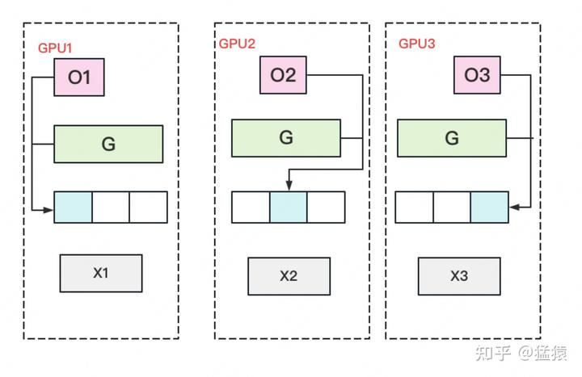

  - At this point, there are some W on each GPU that have not completed the update (the white part in the image). So we need to do an AllGather on W and retrieve the updated parts of W from other GPUs. Generate Φ communication volume per GPU.

- ZERO-2 (partition Adam states and gradients P_os+g):
  - The model parameters are still kept one copy per gpu.
  - The memory requirement of each GPU is: (2Φ + (2Φ + 12Φ) / N) B. When N is large, it tends to be 2Φ B, which is the (1/8) of the original 16Φ B.

  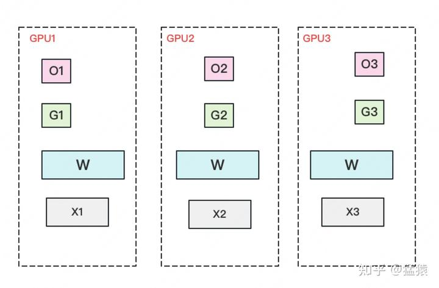

  - A complete copy of parameter W is stored on each GPU. A batch of data is divided into 3 parts, each GPU gets one part, and after completing a round of foward and backward, each gets a part of gradient with complete size (green + white in the image below).
  - Perform a Reduce Scatter on the gradient to ensure that the gradient maintained on each GPU is an aggregated gradient. For example, for GPU1, it is responsible for maintaining G1, so other GPUs only need to send the gradient at the corresponding position of G1 to GPU1 for summation. After the summary is completed, the white blocks are useless to the GPU and can be removed from the video memory. Communication volume of per GPU is Φ.

  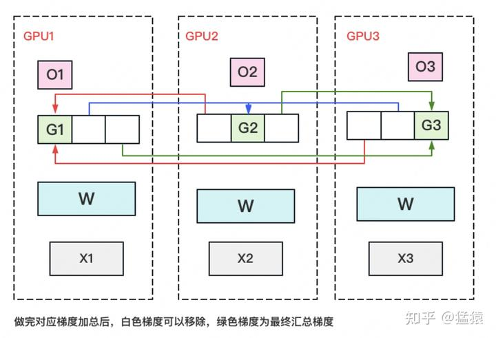

  - Each GPU updates its corresponding W with its own corresponding O and G. After the update is completed, each GPU maintains a part of the updated W. Perform an AllGather on W to synchronize the updated W from other GPUs. Communication volume of per GPU is Φ.
  - Compared to plain DP, the storage has been reduced by 8 times, and the communication volume of for per GPU remains the same.
  - To make this more efficient in practice, we use a bucketization strategy, where we bucketize all the gradients corresponding to a particular partition, and perform reduction on the entire bucket at once.
- ZERO-3 (partition Adam states and gradients parameters and  P_os+g+p):

  

  - Only a portion of parameter W is saved on each GPU. Divide a batch of data into three parts, with each GPU getting one part.
  - When doing forward, perform an AllGather on W to retrieve W distributed on other GPUs to obtain a complete W. Communication volume of per GPU is Φ. After completing the forward, immediately discard the W that was not maintained by itself.
  - When doing the backward, perform an AllGather on W to retrieve the complete W. Communication volume of per GPU is Φ. After completing the backward, immediately discard the W that was not maintained by itself.
  - After completing the backward, obtain a gradient G of complete size, perform a Reduce-Scatter on G, and aggregate the its part of gradient maintained by itself from other GPUs. Communication volume of per GPU is Φ. After the aggregation operation is completed, immediately discard the G that is not maintained by itself.
  - Update W using self-maintained O and G. Since only a portion of W is maintained, there is no need to perform any AllReduce operations on W.
- ZERO-R:
  - P_a: Partitioned Activation Checkpointing
    - Previously, all activations were discarded after calculations were completed. Trade calculations for space. Now, some activations are discarded, and each GPU maintains one activation block. When needed, they are aggregated from other GPUs. Trade bandwidth for space.
    - This is aimed at the collaborative usage of MP (Model Parallelism) in Megatron. Megatron requires each GPU to hold a complete piece of X, while P_a only keeps a portion of X on each GPU. During computation, the missing parts are aggregated as needed. After computation, each GPU holds a complete-sized Y, but only half of the results. Typically, an all-reduce operation would be performed, but since each GPU now only maintains a portion, the all-reduce is only performed for the portion each GPU maintains.
  - C_B: Constant Size Buffer
    - Allocate a fixed-size buffer. The classic approach is to allocate a buffer and wait until it is completely filled before sending the data out. Alternatively, a delay limit can be set, such as waiting for more than 1 microsecond. Even if the buffer is not fully filled, the data is sent out, and the buffer size is dynamically adjusted. If the buffer is frequently filled, it is expanded; if it is often not filled, it is reduced.
  - M_D: Memory Defragmentation

### KV-Cache

- The focus of LLM inference shifts to achieving high responsiveness and throughput.
- Transformer incorporates a self-attention mechanism, which computes Query (Q), Key (K), and Value (V), where the Key and Value matrices typically store information of the entire sequence, while the Query vector corresponds to the token currently being processed in the sequence.
- During inference, the model generates new tokens iteratively by computing attention scores between the Query and the historical Keys, which are then used to calculate a weighted sum over the historical Values.
- Without optimization, this process involves recomputing the Keys and Values of the entire sequence at each generation step, significantly slowing down inference.
- KV-cache strategy caches the Keys and Values of previous tokens to eliminate redundant computation. By storing these two historical results, the model only needs to compute the QKV vectors for the newly generated token and update the cache, significantly improving inference speed.
- However, this approach substantially increases memory requirements as the KV cache grows with the sequence length. In the KV-cache strategy, the primary memory requirement stems from the model parame ters and the KV-cache itself.

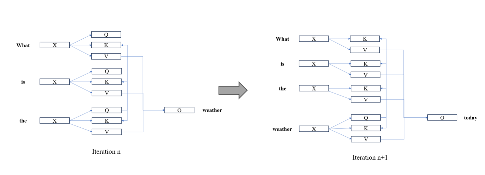

### PipeDream: Generalized Pipeline Parallelism for DNN Training

[PipeDream: Generalized Pipeline Parallelism for DNN Training](https://arxiv.org/abs/1806.03377)

- 

### Mesh-TensorFlow: Deep Learning for Supercomputers

[Mesh-TensorFlow: Deep Learning for Supercomputers](https://arxiv.org/abs/1811.02084)

- 

### Using DeepSpeed and Megatron to Train Megatron-Turing NLG 530B, A Large-Scale Generative Language Model

[Using DeepSpeed and Megatron to Train Megatron-Turing NLG 530B, A Large-Scale Generative Language Model](https://arxiv.org/abs/2201.11990)

- Intra-node communication has a higher bandwidth than inter-node.
- Bandwidth requirement: tensor > data > pipeline.
- Prioritize placing tensor parallel workers within a node.
- Data parallel workers are placed within a node to accelerate gradient communications(when possible).
- Schedule pipeline stages across nodes without being limited by the bandwidth.

### Galvatron: Efficient Transformer Training over Multiple GPUs Using Automatic Parallelism

[Galvatron: Efficient Transformer Training over Multiple GPUs Using Automatic Parallelism](https://arxiv.org/abs/2211.13878)

- Methods for Implementing Automatic Parallel Optimization
- The core contribution of Galvatron lies in its approach to partitioning a large Transformer-based language model into multiple stages. Initially, Pipeline Parallelism (PP) is applied between these stages. Within each stage, the model is further divided by layers, and each layer is assigned a parallel strategy. These strategies are combinations of Tensor Parallelism (TP), Data Parallelism (DP), and Sharded Data Parallelism (SDP).
- Galvatron uses a decision tree to represent its decision space and employs dynamic programming to select the optimal strategy for each layer (i.e., choosing the appropriate decision tree). To reduce the search space (the number of decision trees), Galvatron introduces several heuristic rules for pruning.
- Search Space Decomposition Based on Decision Trees:
  - Takeway#1: The communication volume of Pipeline Parallelism (PP) is significantly lower compared to other parallelization methods. Therefore, people usually prioritize splitting the model using PP and placing it between device islands.
  - Takeway#2: Under the premise of homogeneous devices, parallel strategies tend to evenly partition the devices. For example, for 2-way DP (Data Parallelism) on 4 GPUs, the strategy tends to split the devices into two groups of 2 GPUs each, rather than one group of 1 GPU and another group of 3 GPUs. In this case, the optimal mixed parallel strategy within one device group remains consistent with the optimal strategy in other groups.
  - Takeway#3: Generally, when it is possible to mix DP (Data Parallelism) and SDP (Sharded Data Parallelism), using only SDP theoretically offers better performance.
  - Search space construction method:
    - Given a Transformer model, based on Takeway#1 and Takeway#2, Galvatron first uses PP to split the model into multiple stages while uniformly and continuously dividing the devices into multiple device groups. For example, in an 8-GPU scenario, the model is split into 1/2/4/8-way PP, corresponding to device group sizes of 8/4/2/1, respectively.
    - Each PP split corresponds to a decision tree and a sub-search space. The total number of leaf nodes in the decision tree is equal to the device group size, and the height of the decision tree is the number of available parallel methods, meaning each layer of the decision tree can apply one parallel strategy.
    - Parallel strategies cannot be reused across different layers of the decision tree.
    - The degree of non-leaf nodes is selected by default from powers of 2, such as {2, 4, 8, ...}.
  - Takeway#1 and Takeway#2 help Galvatron avoid inefficient parallel combinations, thereby reducing the search space. For an 8-GPU scenario training a single-layer model, the above rules produce 34 candidate mixed parallel strategies. Further, after pruning scenarios where both DP and SDP appear in the same decision tree using Takeway#3, the number of candidate strategies for 8 GPUs is reduced to 22.

  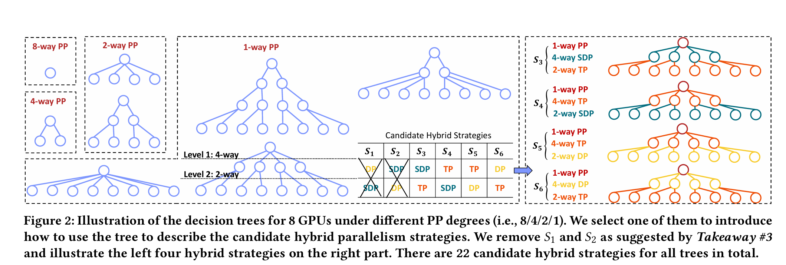

- Parallel Optimization Algorithm Based on Dynamic Programming:
  - Given an L-layer model and N GPU devices with memory capacity E, Galvatron's optimization goal is to search for the highest system throughput and return the corresponding parallel scheme. The parallel scheme refers to a fine-grained mixed parallel strategy based on layers (or operators) as the fundamental units.
  
  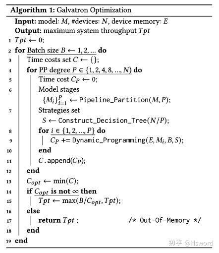

  - After obtaining the strategy set S, we perform a dynamic programming search for each model stage M_i to determine how to parallelize each layer in M_i under the limited device memory budget E, while minimizing the execution time. If the device memory is not exceeded, the search algorithm returns the minimum time cost, which is then accumulated for all stages (line 9). Here, we exclude the activation transfer costs at the boundary layers in PP, as they are usually small. By comparing the results of all possible PP degrees (line 13) and batch sizes, Galvatron achieves the maximum throughput (line 15).
  - To obtain the shortest execution time C(L,E), we explicitly state that the solution must include the subproblem solution C(L′,E′), which represents the shortest execution time for the submodel (i.e., the first L′layers, where L′≤L) within a smaller device memory budget E′
  (where E′≤E). This clarification holds because if the optimal solution C(L,E) does not include a specific C(L′,E′), we can always reduce the total execution time by replacing the subproblem solution with C(L′,E′). Due to the linear sequence model structure, the parallelization plan for the first L′ layers does not affect the remaining L−L′ layers under the same memory budget E−E′.
  - The outermost loop of Galvatron incrementally increases the batch size for the search until it exceeds the device memory. For each candidate batch size B, Galvatron first performs PP partitioning on the model based on Takeaway#1 and searches for different degrees of parallelism P (line 4). After selecting the PP, the model is divided into P stages (line 6), and all corresponding devices are divided into P groups, with each group containing N/P devices. Next, Galvatron constructs a corresponding decision tree, which can comprehensively and non-redundantly represent any combination of DP, SDP, and TP, thereby obtaining the strategy set S. Then, for each model stage M_i, under the device memory constraint E, Galvatron uses dynamic programming to search for the optimal mixed parallel strategy for each layer and returns the minimum time cost (line 9). Finally, Galvatron selects the strategy with the highest throughput among all possible PP degrees and batch sizes and returns it (line 15).
  - For a given model stage containing L layers, the cost function C(L,E) represents the total execution time of the L-layer model under the device memory constraint E. c(L,S_j) denotes the execution time of the L-th layer using strategy S_j, where strategy S_j is a candidate from the parallel strategy set S. Setting the initial values C(0,*)=0 and C(*,0)=∞, Galvatron's dynamic programming search follows the following state transition equation:

  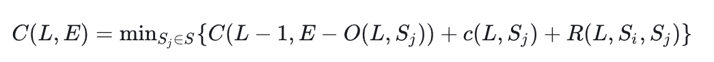

  - O(L,S_j) is the memory overhead of the L-th layer using strategy S_j, and R(L,S_i,S_j) is the transition overhead caused by the L-th layer using strategy S_j and the previous layer using strategy S_i. During the state transition process, if the memory overhead exceeds the device memory limit E, the cost function C returns infinity.
  - R(L,S_i,S_j): If two adjacent layers have different parallel strategies, the output of the previous layer must be transformed into the required data layout to facilitate the parallelism of the next layer. For example, if the previous layer uses a combination of 2-way DP and 2-way TP, and the current layer attempts to use 4-way DP, a conversion step is needed to prepare a complete model replica for the current layer and 1/4 of the forward activations on each device.
- Execution Cost Estimation Method Based on Hybrid Modeling：
  - Existing cost estimation methods mainly include profiling and simulating.
  - For memory overhead, estimate it using the shape and data type of tensors.
  - For computation time, measure the per-sample computation time on a single device through profiling, then estimate the total computation time by combining the batch size and a fitting function.
  - For communication time, estimate it by dividing the communication volume by the device communication bandwidth. The communication volume is derived from theoretical calculations, while the communication bandwidth is obtained through profiling.
  - Based on the above estimation results, Galvatron simulates the execution process to calculate the overhead of a given layer using a given strategy.
  - There is performance degradation due to overlapping computation and communication on GPUs. This performance degradation is not caused by blocking due to communication-computation dependencies. Through experiments, the authors found that overlapping communication and computation occupies GPU computing resources (e.g., CUDA cores), significantly affecting the execution efficiency of both.

### Mixed Precision Training

- FP16 occupies half the memory of FP32 and is faster to compute, which can facilitate the training of larger models.
  - Data Overflow: Underflow, Numbers close to zero may be rounded to zero due to rounding errors Overflow, Extremely large numbers may be approximated as infinity.
  - Rounding Errors: Differences between the approximate value obtained from computation and the exact value, such as 0.3 becoming 0.30000000000000004. These small errors can accumulate over time.
- FP32 Weight Backup: Solves rounding error
  - Maintain a master copy of weights in FP32 (Master-Weights), while using FP16 to store weights, activations, and gradients during training. During parameter updates, update the FP32 master weights using FP16 gradients.
- Loss Scaling: Solves underflow
  - When using FP16 instead of FP32 for gradient updates, values that are too small can cause underflow in FP16 precision, leading some gradients to become zero and preventing model convergence.
  - FP16 is used for storage and multiplication. FP32 is used for accumulation to avoid rounding errors.

### GShard: Scaling Giant Models with Conditional Computation and Automatic Sharding

[GShard: Scaling Giant Models with Conditional Computation and Automatic Sharding](https://arxiv.org/abs/2006.16668)

- Mixture-of-Experts: assign inputs to different expert models, with each expert focusing on processing specific types of inputs, thereby increasing the model's capacity and performance while maintaining computational efficiency.
- MoE consists of multiple small neural networks (experts), each responsible for processing a portion of the inputs.
- A gating network determines which experts to assign the inputs to, typically selecting the top-k most relevant experts.
- Only a few experts are activated at a time, reducing computational costs and making it suitable for large-scale models.
- To prevent overloading certain experts, a load balancing mechanism is introduced to ensure even distribution of workload among experts.

### Beyond Data and Model Parallelism for Deep Neural Networks

[Beyond Data and Model Parallelism for Deep Neural Networks](https://arxiv.org/abs/1807.05358)

- The SOAP Search Space:
  - Samples, partitioning training samples (Data Parallelism)
  - Operators, partitioning DNN operators (Model Parallelism)
  - Attributes, partitioning attributes in a sample (e.g., different pixels)
  - Parameters, partitioning parameters in an operator
  - Operators Parallelism: Different Conv of different channels on different devices. Attribute Parallelism: High resolution image, sub pixel blocks on different devices.
- Operator graph: Edges represent tensors while nodes represent operators.
- Device topology: Edges represent device's connection. Nodes represent devices.
- Execution Simulator:
  - Takes the operator graph and device topology as inputs to automatically find the optimal parallel strategy.
  - Transformed into a cost minimization problem, specifically minimizing the predicted execution time.
  - The number of possible strategies is exponential with respect to the number of operators, resulting in an excessively large search space.
  - To address the large search space, heuristic algorithms are employed.
- MCMC Sampling:
  - Maintain a current strategy S, and randomly propose a new strategy S∗. S∗is accepted with the following probability:

  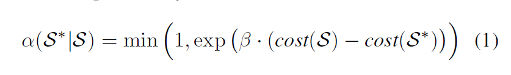

  - Randomly select an operator from the current strategy and replace its parallelization configuration c with a random configuration. Use the predicted execution time as the loss function in the equation.
  - Use existing strategies (e.g., data parallelism, expert strategies) or randomly generated strategies as initial candidates.
  - For each initial strategy, the search algorithm iteratively proposes new candidates until one of the following two criteria is met: (1) The search time budget for the current initial strategy is exhausted; or (2) The search process cannot further improve the best-found strategy within half of the search time.
- Task Graph
  - Hardware connections are also modeled as devices, with the distinction that they can only perform communication and not computation. This abstract modeling allows for the overlapping of communication and computation.
  - In this graph, nodes represent tasks (either computation or communication), and edges (t_i,t_j) represent dependency relationships, indicating that t_j​ must wait for t_i to complete before it can start. However, this graph is not a data flow graph; data flow is represented by communication tasks.
  - For each o_i's c_i, add t_i:1,t_i:∣c_i∣ to the graph (i.e., o_i is divided into ∣c_i∣ parts, and each part is added to the graph).
  - For each edge (o_i,o_j) in the Operator graph, where the output of o_i is the input of o_j, compute the subtensors and match them. For each subtensor pair t_i:ki and t_j:kj that share a vector, if they are on the same device, the task graph adds an edge between these two tasks to indicate a dependency relationship. If they are on different devices, a communication task t_c is added to the graph, and two edges (t_i:ki,t_c) and (t_c,t_j:kj) are added to the graph.

  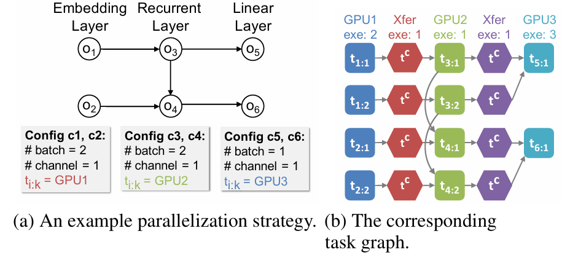

  - For Regular Tasks: The exetime (execution time) is the time it takes to execute a task on a given device. This is obtained by running the task multiple times on the device and taking the average time. This value is cached, and for subsequent operations with the same operation type and input/output tensor sizes, this cached value is used directly without re-running the task.
  - For Communication Tasks: The exetime is the time required to send a tensor of size s over a bandwidth b, estimated using the formula s/b.
- Full Simulation Algorithm:
  - Construct the task graph.
  - Use a variant of Dijkstra's shortest path algorithm to set the attributes for each task. Tasks are enqueued into a global priority queue when they are ready (i.e., all their predecessor tasks have been completed). They are then dequeued in increasing order of their ready time. This ensures that whenever a task is dequeued, all tasks with an earlier ready time have already been scheduled.

  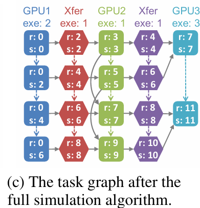

- Delta Simulation Algorithm
  - Use the MCMC (Markov Chain Monte Carlo) search algorithm to propose new parallelization strategies by altering the parallelization configuration of a single operator from the previous strategy.
  - Start from the previous task graph and only re-simulates the tasks involved in the portions of the execution timeline that have changed. This optimization significantly speeds up the simulator.
  - To simulate a new strategy, the incremental simulation algorithm first updates the tasks and dependencies from the existing task graph and enqueues all modified tasks into a global priority queue. Similar to the Bellman-Ford shortest path algorithm (Cormen et al., 2009), the incremental simulation algorithm iteratively dequeues the updated tasks and propagates the updates to subsequent tasks.

  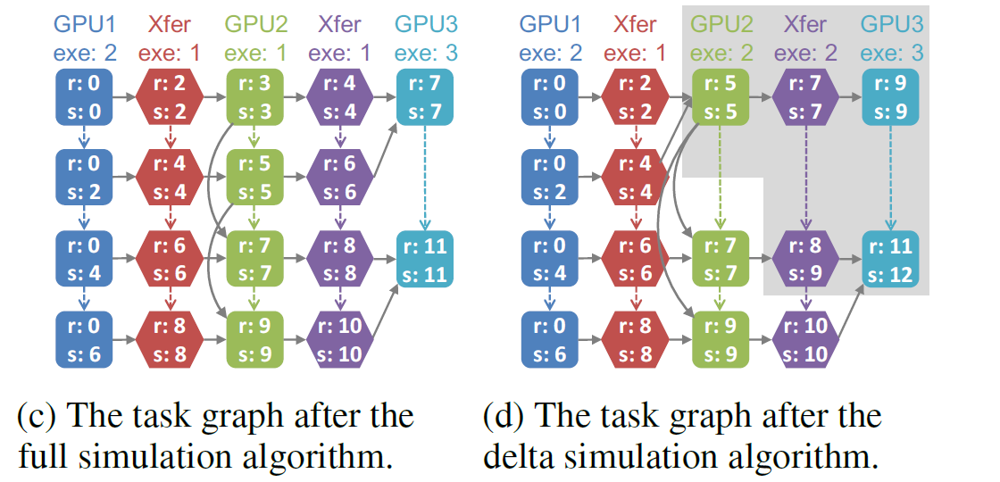

### Efficient Large-Scale Language Model Training on GPU Clusters Using Megatron-LM

[Efficient Large-Scale Language Model Training on GPU Clusters Using Megatron-LM](https://arxiv.org/abs/2104.04473)

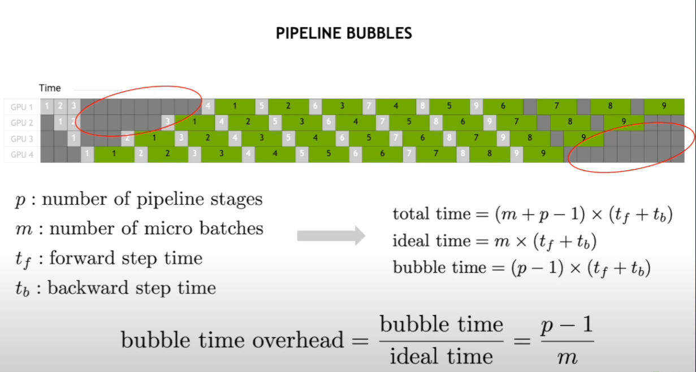

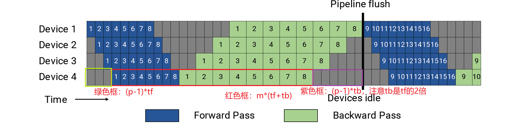

- Gpipe: To reduce bubble time, the value of m (number of microbatches) should be as large as possible. However, an excessively large m leads to each stage needing to store too many activations during execution, thereby increasing memory requirements.

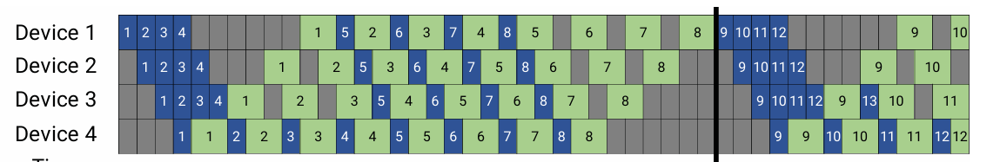

- PipeDream's 1F1B (One Forward One Backward): PipeDream advances the backward pass timing for each microbatch. In Gpipe, all microbatches wait until the entire forward pass is completed before starting the backward pass. In contrast, PipeDream starts the backward pass for a microbatch as soon as it completes the forward pass across all stages. Once the backward pass is done, memory is freed, significantly reducing memory pressure. By executing one forward pass followed by one backward pass, the number of in-flight microbatches is reduced. In-flight microbatches refer to those for which the backward pass has not yet completed, requiring the storage of intermediate data during the iteration. With this approach, the maximum number of in-flight microbatches (those with completed forward passes but incomplete backward passes) throughout the pipeline execution does not exceed p (number of pipeline stages).

- Schedule with Interleaved Stages

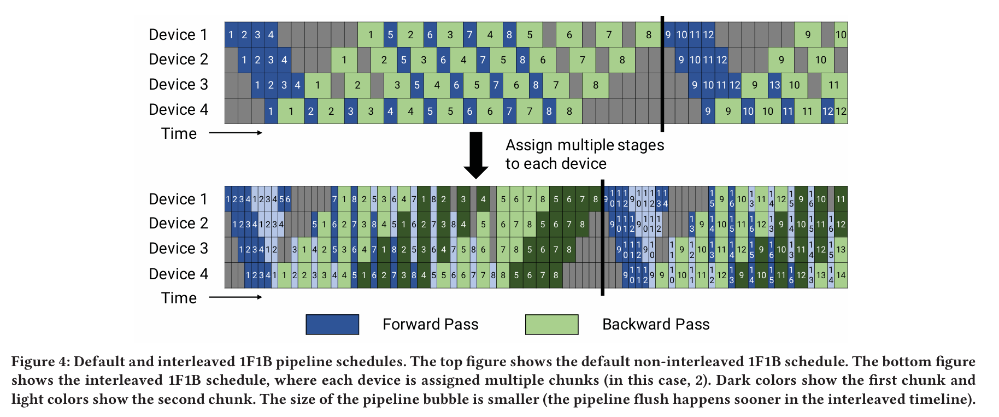

  - The core improvement of InterleavedStage lies in assigning multiple stages to each GPU (in the example above, each GPU carries 2 stages). 
  - Taking a 16-layer transformer model as an example, the strategy uses 4 GPUs and divides the model into 8 stages, with each GPU hosting 2 stages (i.e., 4 transformer layers). Specifically: GPU 1 hosts layers 1, 2, 9, and 10. GPU 2 hosts layers 3, 4, 11, and 12. GPU 3 hosts layers 5, 6, 13, and 14. GPU 4 hosts layers 7, 8, 15, and 16.
  - For each microbatch, starting from GPU 1, after passing through layers 1, 2, 3, 4, 5, 6, 7, and 8, it returns to GPU 1 to process layers 9 and 10. This strategy reduces the bubble time on each GPU.
  - If each GPU hosts v stages, then for each microbatch, the forward and backward time for each stage is t_f / v and t_b / v, respectively. The pipeline's bubble time is reduced to:

  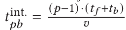

  - Thus, the bubble time ratio for InterleavedStage is:

  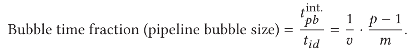

  - This means that Interleaved Stage can reduce the bubble rate by a factor of v. However, it is important to note that this is not without cost. The strategy also increases the communication volume by a factor of v. Therefore, when applying this approach, it is necessary to consider the actual hardware conditions and carefully weigh whether to use Interleaved Stage and how to implement it effectively.

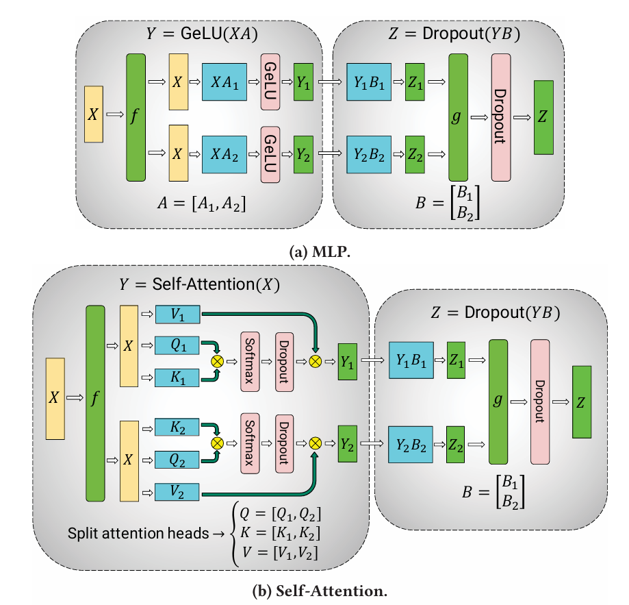

- This MLP module's overall structure can be represented by Y=GeLU(XA) and Z=Dropout(YB).
- In tensor parallelism, matrix A is split column-wise into A=[A1,A2], and the computation is performed on respective GPUs as follows:[Y1,Y2]=[GeLU(XA1),GeLU(XA2)]. Meanwhile, matrix B is split row-wise B=transpose([B1,B2]), resulting in: Z1=Y1B1,Z2=Y2B2,Z=Z1+Z2. Therefore, in the figure: f represents the forward pass's equivalent operation and the backward pass's all_reduce operation. g represents the forward pass's all_reduce operation and the backward pass's equivalent operation.
- Compared to the two-layer fully connected splitting in the MLP, the splitting for self-attention only replaces the first layer's fully connected splitting with the splitting of the QKV weights.

- (p,t,d): p: Represents the pipeline parallelism dimension. t: Represents the tensor parallelism dimension. d: Represents the data parallelism dimension.
- n: Represents the number of GPUs, typically satisfying p⋅t⋅d=n.
- B: Represents the global batch size.
- b: Represents the microbatch size.
- m = B/(bd): Represents the number of microbatches in the pipeline.

- Tensor and Pipeline Parallelism:
  - Bubble Time Ratio=(p-1)/m. Assuming d=1 and tp=n, the relationship for pipeline parallelism can be expressed as: (n/t-1)/m. As t increases, for fixed values of B, b, and d, the bubble time ratio decreases.
  - Tensor parallelism increases the communication volume between devices. When t exceeds the number of devices (e.g., GPUs) within a single compute node, the communication bottleneck between nodes can reduce the throughput of model training.
  - **Takeaway#1**: When training extremely large models using both tensor and pipeline parallelism, the degree of tensor parallelism (t) should typically be set to the number of GPUs within a single compute node, while pipeline parallelism (p) can be increased until the model fits within the cluster.
  - The communication between GPUs is also influenced by p (pipeline parallelism degree) and t (tensor parallelism degree).
  - For Pipeline Parallelism (PP): For each pair of connected devices (during either the forward or backward pass), the communication volume per microbatch is bsh, where: b is the batch size, s is the sequence length, h is the hidden layer size.
  - For Tensor Parallelism (TP): A tensor of size bsh requires all-reduce communication twice during both the forward and backward passes across t model replicas. The total communication volume is: 8bsh((t-1)/t) per layer, per device, per microbatch. Since each device typically handles many layers, the total communication volume per device per microbatch is: l_stage*8bsh((t-1)/t), where l_stage is the number of layers per stage.

- Data and Pipeline Parallelism
  - Assuming t=1, the number of microbatches in the pipeline is: m=B / (db) = b'/d, where b'=B/b. When the number of GPUs is n, the number of pipeline stages is p=n/d. Thus, the bubble time ratio for the pipeline is: (n-d)/b'.

  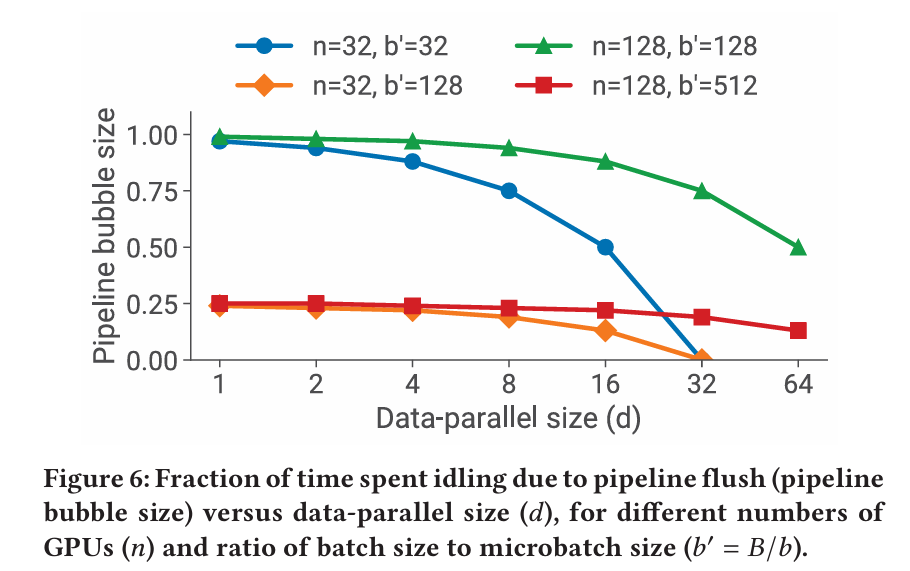

  - As shown in the figure, when d (data parallelism degree) increases, the bubble time ratio decreases. However, since the model size occupies a significant amount of memory, the data parallelism degree cannot be increased indefinitely.
  - At the same time, when B (global batch size) increases, b′=B/b also increases, leading to a reduction in the bubble time ratio. Additionally, the frequency of communication in data parallelism decreases, which can improve throughput.
  - **Takeaway#2**: When using a combination of data and model parallelism, the total model parallelism dimension M=t⋅p should be set to ensure that the model can fit into the GPUs and support training. The data parallelism dimension can then be increased to utilize more GPUs and enhance model throughput.
  - The communication volume in data parallelism is proportional to (d−1)/d, meaning that as d (the degree of data parallelism) increases, the communication volume decreases.

- Microbatch Size

  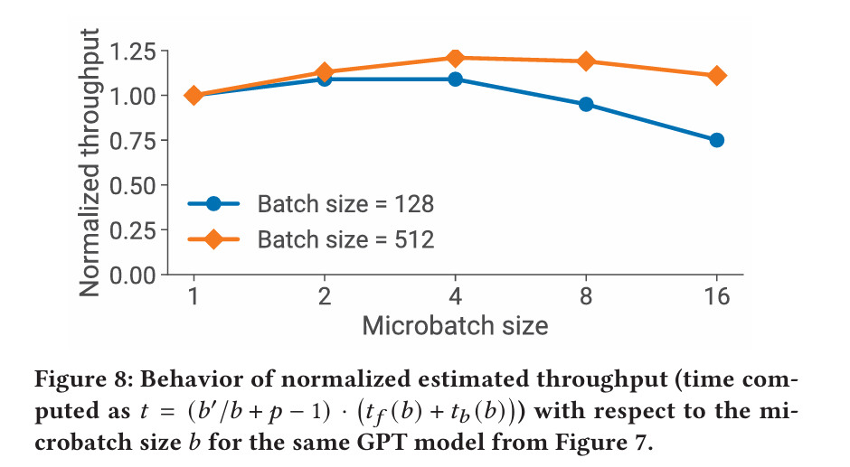

  - **Takeaway#3**: The optimal microbatch size 𝑏 depends on the throughput and memory footprint characteristics of the model, as well as the pipeline depth 𝑝, data-parallel size 𝑑, and batch size 𝐵.
  - The communication volume in data parallelism remains constant, regardless of the microbatch size.

- Activation Recomputation
  -  For most cases, checkpointing every 1 or 2 transformer layers is optimal.

### Accelerating Training of Transformer-Based Language Models with Progressive Layer Dropping

[Accelerating Training of Transformer-Based Language Models with Progressive Layer Dropping](https://arxiv.org/abs/2010.13369)

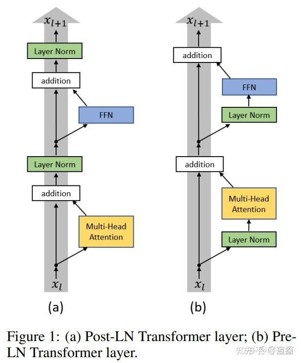

- The original BERT uses Post-Layer Normalization (PostLN).
- Issues with PostLN: Unbalanced gradients, as the layer ID decreases, the gradients tend to vanish. Higher sensitivity to hyperparameters, if the learning rate is set too high, training can fail.
- Pre-Layer Normalization (PreLN): The gradients across layers are more balanced, with each layer's gradient being similar in magnitude. The ratio of each layer's gradient to the input x_i is also very similar, typically close to 1.

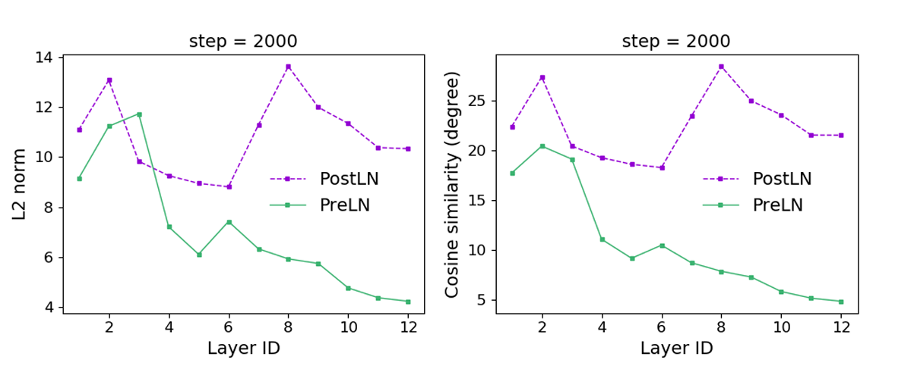

- Although the dissimilarity remains relatively high and bumpy for PostLN, the similarity from PreLN starts to increase over successive layers, indicating that while PostLN is still trying to produce new representations that are very different across layers, the dissimilarity from PreLN is getting close to zero for upper layers, indicating that the upper layers are getting similar estimations. 
- This can be viewed as doing an unrolled iterative refinement, where a group of successive layers iteratively refine their estimates of the same representations instead of computing an entirely new representation.

- Randomly Dropping Some Layers:
  - PostLN: The performance drops significantly. If the learning rate is increased, training may fail.
  - PreLN: Since the later layers are refining representations, dropping them introduces some noise, which slightly affects performance but not significantly. However, the earlier layers are computing new features, so they cannot be dropped.

- Initial Training Phase: Whether using PostLN or PreLN, the representations in the lower layers differ significantly. This is because the model parameters are randomly initialized, and the model is rapidly converging at this stage. Therefore, inserting a layer-drop strategy is not suitable during this phase.
- As Pretraining Progresses: Although the variation in PostLN is smaller, the differences in the top-layer representations remain significant. In contrast, the differences in the lower-layer representations of PreLN become very small. At this point, it can be concluded that the top layers of the model are continuously refining their representations rather than generating entirely new ones.
- Note: Layer drop is only feasible when the differences in representations between layers are small.

- Switchable-Transformer blocks:

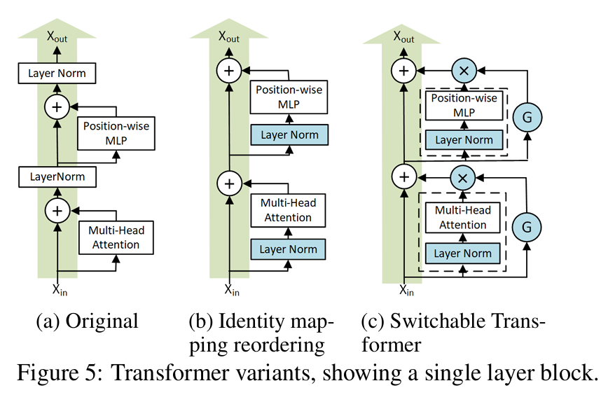

  - Replace Post-Layer Normalization (PostLN) with Pre-Layer Normalization (PreLN) by placing the layer normalization only on the input stream of the sublayers.
  - Switchable Gates: Each sublayer includes a gate that controls whether the sublayer is enabled or not.
  Specifically, for each microbatch, the two gates of the two sublayers determine whether to apply their respective transformation functions or simply retain the identity mapping connection. This is equivalent to applying a conditional gate function G to each sublayer, as shown below:

  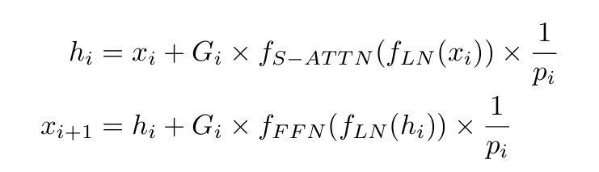

  - G_i only takes 0 or 1 as values, sampled from a Bernoulli distribution, where p_i is the probability of obtaining 1.
  - Since this block is selected with probability p_i during training but is always present during inference, a correction is needed for the layer output. This is achieved by applying a scaling factor of 1/p_i whenever the layer is selected.

- A progressive schedule is a function t -> θ(t), such that θ(0) = 1 and lim(t->∞)θ(t)->θ', where θ'∈(0,1].

- Along the time dimension
  - For Transformer networks, during the early stages of training, the differences in representations between layers remain significant. Therefore, layer-drop cannot be applied in the early training phase. However, as training progresses, networks based on Pre-LN can gradually incorporate layer-drop.
  - To achieve this, a monotonically decreasing function is used to control the dropping probability, ensuring that the probability of dropping layers increases over time.

  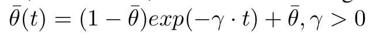

- Along the depth dimension
  - The above progressive schedule assumes all gates in ST blocks take the same p value at each step t.
  - However, the lower layers of the networks should be more reliably present.
  - Therefore, the author distribute the global θ across the entire stack so that lower layers have lower drop probability linearly scaled by their depth.

  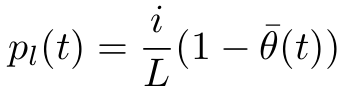

- Putting together:

  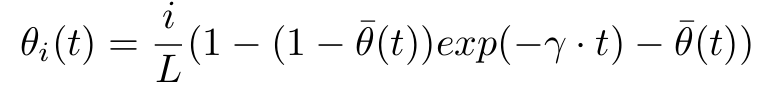

- With a large learning rate, the performance of BERT + PreLN is slightly better than that of BERT + PostLN.
- Under the same configuration, random layer drop and time-based scheduling yield similar results. This demonstrates that the benefits of PLD (Probabilistic Layer Drop) primarily come from spatial scheduling.
- If time-based scheduling is disabled, training with AMP (Automatic Mixed Precision) may produce NaN values, making normal training impossible. In this case, only FP32 precision can be used for training. This indicates that time-based scheduling contributes to both the efficiency and stability of training.

### Large-Scale Deep Unsupervised Learning Using Graphics Processors

[Large-Scale Deep Unsupervised Learning Using Graphics Processors](https://dl.acm.org/doi/10.1145/1553374.1553486)

- 

### DeepSpeed Inference: Enabling Efficient Inference of Transformer Models at Unprecedented Scale

[DeepSpeed Inference: Enabling Efficient Inference of Transformer Models at Unprecedented Scale](https://arxiv.org/abs/2207.00032)

- Deep-Fusion:
  - Fusing multiple operators is a commonly used technique in deep learning to reduce kernel launch and data movement overhead: it is primarily limited to element-wise operators.
  - Transformers consist of operators such as data layout transformations, reductions, and GeMM, which create data dependencies between thread blocks, making fusion challenging. This is because, on GPUs, if data generated by one thread block is used by another, global memory synchronization is required to invoke a new kernel.
  - Deep-Fusion involves splitting dimensions without data dependencies into different tiles, handling data-dependent dimensions within a single thread block, and parallelizing non-data-dependent dimensions across different tiles, followed by fusion between tiles.)
- Custom GeMM for Small Batch Size:
  - Tiling Strategies: Tile the computation along the output dimension, which allows to implement GeMM using a single kernel by keeping the reduction within a tile. For small models, where the output dimension is too small to create enough parallel tiles to achieve good memory bandwidth, tile the input dimension as well and implement GeMM as two kernels to allow for reduction across tiles.
  - Cooperative-Group Reduction:
    - With the aforementioned tiling strategy, each warp in a thread block is responsible for producing a partially reduced result for a tile of outputs and a final reduction is needed across all the warps within the thread block. Usually this is implemented as a binary tree based reduction in shared memory which requires multiple warp level synchronizations, thus creating a performance bottleneck.
    - To avoid this, perform a single data-layout transpose in shared memory such that partial results of the same output element are contiguous in memory, and can be reduced by a single warp using cooperative-group collectives directly in registers.
    - At the end, the first thread of each warp holds the final result and writes it to shared memory. The results in shared memory are contiguous, allowing for a coalesced write to global memory.
  - Leveraging Full Cache-line:
    - Transpose the weight matrix during initialization such that M rows for each column are contiguous in memory, allowing each thread to read M elements along the input dimension.
- Dense Model Inference (TP + PP):
  - Set the number of micro-batches to the pipeline depth P. Avoid intermediate pipeline bubbles by dynamically queuing micro-batches of generated tokens until the sequence terminates.
  - Cached key and value activation tensors exhibit predictable reuse patterns. The activations for sequence s_i will not be used again until the next token of s_i is generated. When the allocated activation memory exceeds a threshold, offload some unused activations from the GPU to CPU memory. The saved GPU memory allows for larger batch sizes and improves system utilization.
  - Two GPUs share a PCIe link, with odd and even GPUs alternating usage. Odd GPUs offload activations from odd layers, while even GPUs offload activations from even layers.
- Sparse Model Inference (TP + DP + EP):
  - Use tensor parallelism as tensor-slicing(for non-expert parameters) and expert-slicing (for expert parameters), to split individual parameters across multiple GPUs to leverage the aggregate memory bandwidth across GPUs. However, tensor parallelism can only scale efficiently to a few GPUs due to communication overhead and fine-grained parallelism. 
  - Use expert parallelism in conjunction with tensor parallelism to scale experts parameters to hundreds of GPUs. Expert parallelism does not reduce computation granularity of individual operators, therefore allowing system to leverage aggregate memory bandwidth across hundreds of GPUs. 
  - To scale the non-expert computation to the same number of GPUs, use data parallelism at no communication overhead.
  - Expert parallelism places expert operators across GPUs and requires all-to-all communication between all expert-parallel GPUs. However, it is not efficient to scale expert parallelism to hundreds of devices needed for sparse model inference as the latency increases linearly with the increase in devices.
  - Tensor-slicing splits individual operators across GPUs and requires all-reduce between them. The allreduce operation in tensor-slicing replicates data among the involved devices. When executing tensor-parallel operators followed by expert-parallel operators, this replication allows creating an optimized communication schedule for the all-to-all operator that does not require communicating between all the expert parallel processes: the all-to-all can happen within just the subset of devices that share the same tensor-slicing rank, since the data across tensor-parallel ranks are replicated.
  - Similarly, when executing expert-parallel operators followed by tensor-slicing operators, the final all-to-all can be done in the same way, but this time followed by an allgather operator between tensor-parallel ranks to replicate the data needed by tensor-slicing.
  - Optimize gating function:
    - Replace the one-hot representation of the token to expert mapping using a table data-structure, greatly reducing the memory overhead from eliminating all the zeros in the one-hot vectors.
    - Create the inverse mapping (expert-totokens mapping table) from the tokens-to-expert mapping table by simply scanning though the token-to-expert table in parallel.
    - Replace the sparse einsum based scatter operation using a data-layout transformation that achieves the same result by first identifying the token IDs assigned to an expert using the expert-to-token mapping table created in the previous step, and then copying these tokens to the appropriate expert location.
    - After the tokens are processed by their corresponding experts, use a similar data-layout transformation to replace the sparse einsum based gather operation.
- ZeRO-Inference:
  - Utilize all available storage (GPU memory, CPU memory, SSD).
  - Bad Approach: Load as much of the model weights into GPU memory as possible, and load the remaining weights when needed. This method reduces the latency of loading weights (since some are already in GPU memory), but it results in a small batch size. If the model is extremely large, only a small portion of the weights will reside in GPU memory, making the reduction in loading time negligible.
  - Better Approach: Store weights in CPU memory or SSD, and stream one layer or a few layers into GPU memory when needed. This allows for a larger batch size, and since large models have high computational density, computing a single layer takes a significant amount of time. Therefore, a large batch size ensures that computation time dominates the latency of fetching model weights, ultimately improving efficiency.
  - Further Optimization: Implement prefetching (configurable for the number of layers, balancing time and GPU memory usage). If multiple GPUs are available, each GPU can load a portion of the model using the slower PCIe connection, and then integrate the results using the faster GPU-GPU interconnects.