### Motivation

In traditional cloud gaming architecture, a game instance is running in the cloud. The thin client sends users’ input to cloud gaming server. The server does the game logics computation and full-frame rendering. The final rendered image is streamed back to thin client to display.
- Advantages: Enable play on thin devices, easy to deploy, compatible with legacy applications.
- Disadvantages: Introduces high latency, completely inaccessible to content when no network connection.

As hardware evolves, thin devices has growing performance and is more capable of just displaying image. There are many powerful idle devices near the end users which can form an ad-hoc/transient cloud to supplement the computing system. Traditional cloud gaming server is located in data center far from user, which incurs high latency and increases the operation cost. A Hybrid solution for scalable and cloud-native gaming: Perform basic and latency-sensitive computation on local devices. Use cloud computing resource to scale up the game application.

This research aims at investigating the feasibility of utilizing idle devices within a LAN network for distributed rendering and to identify potential challenges.

### Ad-hoc Cloud Computing

Ad hoc Cloud is an emerging area of research that refers to a computational model leveraging existing, non-exclusive, and sometimes unreliable infrastructures to obtain computing resources. It is rooted in the concepts of volunteer and grid computing but has a key difference: Ad hoc Cloud operates as a local cloud made up of volunteer resources. This setup eliminates the need for trust between users and the infrastructure, ensuring job continuity while minimizing interference with the host devices. It is particularly adept at handling a variety of workloads. 

Typically, an Ad hoc Cloud consists of a group of nearby mobile devices that are willing to share resources. This helps alleviate the computational bottleneck at the edgeserver. Furthermore, it enables the execution of compute-intensive applications locally, especially whenremotenetworkconnectionsareproblematic. By facilitating a cloud-style model within a local network, Ad hoc Cloud effectively utilizes idle computing resources, enhancing device utilization and reducing energy consumption.

### The Rendering Equation

The Rendering Equation describes how light is transported around a scene to determine the color of visible surfaces. A mathematical model used to calculate the color and brightness of each pixel by accounting for the light emitted and reflected in different directions, including the effects of shadows, reflections, and indirect illumination.

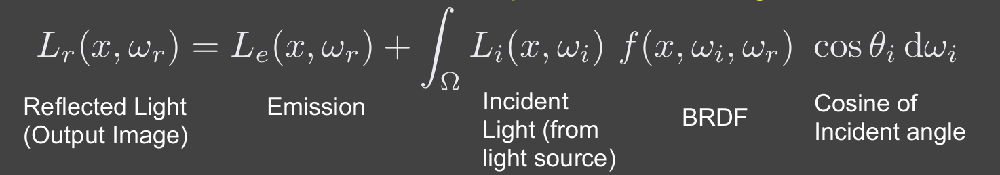

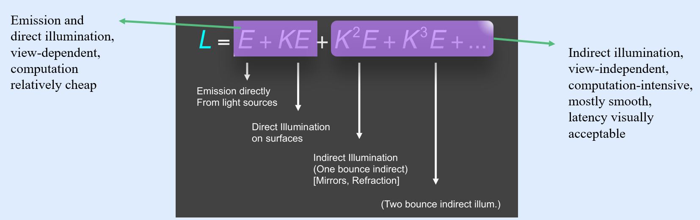

- Direct illumination and indirect illumination can be computed separately and doing integration finally.
- Perform direct illumination computation on local device (rasterization or ray tracing) and distribute indirect illumination to other devices (path tracing, radiosity, photon mapping, etc.).

### Path Tracing

Path Tracing is a Monte Carlo-based algorithm that approximates the solution by stochastically sampling light paths.

It traces rays from the camera, allowing each ray to interact with surfaces according to their material properties, including reflection, refraction, scattering, and absorption. Rays are traced back to their origins, typically a light source, and the contributions from all sampled paths are combined to compute the final pixel color. Russian Roulette (RR) is used to terminate rays probabilistically to control computation intensity. Path Tracing produces highly realistic rendered images, it is computationally expensive. Often limited to offline rendering.

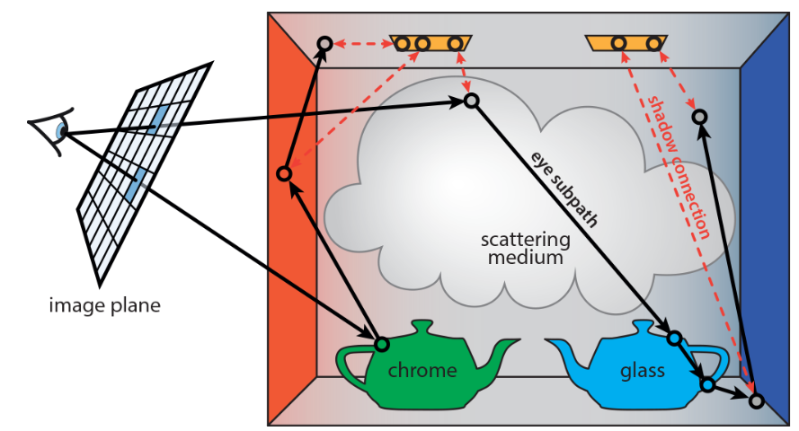

### CloudLight

CloudLight is a system proposed by NVIDIA that computes indirect lighting asynchronously on an abstracted, computational “cloud”.

The blue section on the left represents computations performed on the server, while the black section on the right represents computations performed locally on the client. The arrows indicate the bandwidth requirements between these components. The rendering pipeline is divided at the point with the lowest bandwidth demand.

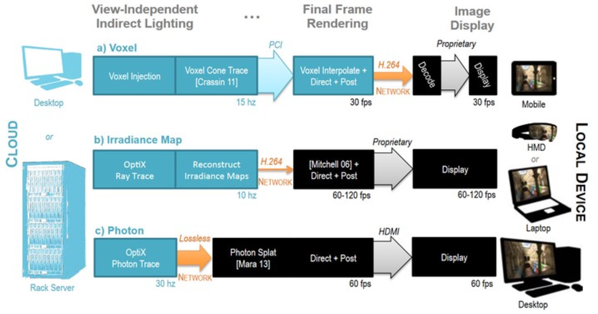

### The Distributed Path Tracer System Architecture

- A classical Client-Server architecture, where both the client and server share a similar rendering algorithm and environment setup. The server executes the traditional path-tracing algorithm.
- The glossy reflection model is implemented using the Frostbite 3 standard material BRDF, which includes diffuse and specular components. A joint bilateral filter is applied for final image de-noising.
- The key difference in computation between the client and the server: The client only calculates the contribution from the light source, as indicated in the first code block of the pseudo code.

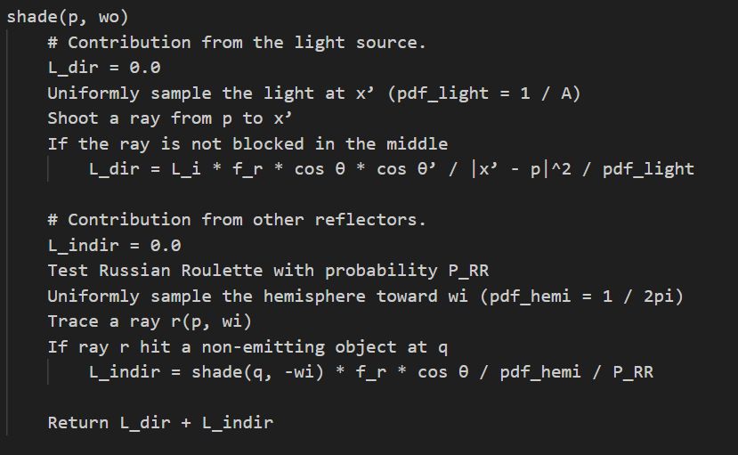

- A single client, acting as the system initiator, and multiple servers to facilitate load balancing.
- The client computes the entire frame of direct lighting using ray-tracing techniques, while the servers handle path-tracing computations for their assigned pixel blocks. The servers transmit their partially rendered results to the client, which integrates the indirect lighting information with its locally computed direct lighting image to produce the final output.
- The client broadcasts all user inputs—such as camera movements, field-of-view (FoV) changes, light placements, window size adjustments, tracing commands, and algorithm parameter updates—to all servers. 
- When a new server connects, the client detects the event, initializes the new server with its current state, and schedules pixel block task allocation. 
- If a server disconnects due to hardware or network failures, the client detects the issue and redistributes the pixel block tasks accordingly.

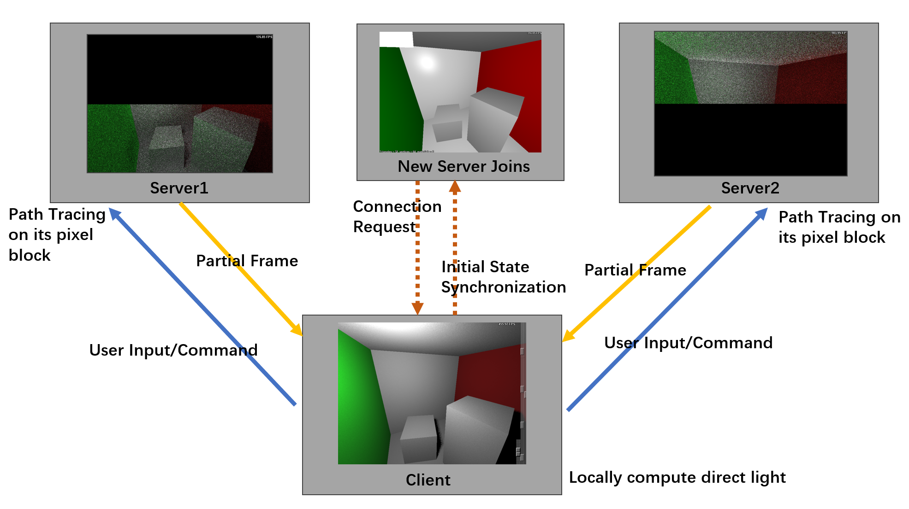

### Automatic New Server Detection and Initial State Synchronization

- Leverages ZeroMQ's Router-Dealer communication pattern, which supports asynchronous, non-blocking communication for multiple clients interact with multiple servers.
- The client monitors a dedicated port for new server connections. 
- When a server connects, it sends a "hello" message to the client and waits for a reply in a blocking manner. 
- The client periodically checks the monitoring port for incoming messages. Upon receiving a message, the client verifies whether the sender's identity is new. If the server identity is unrecognized, it indicates a new server connection. 
- The client records the server's identity in its active server array and assigns it an ID for subsequent pixel block scheduling.
- Following this, the client sends its complete state to the newly connected server. The server uses this data to synchronize its state.

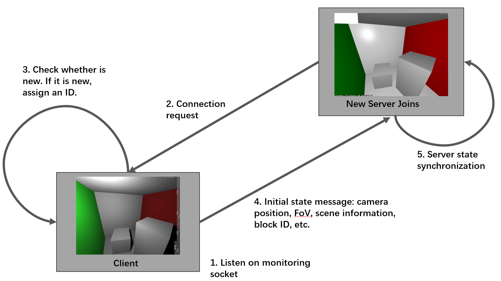

### User Input Synchronization

- Utilizes ZeroMQ's Pub-Sub pattern. The Pub-Sub pattern allows a Publisher (Pub) to send messages to multiple Subscribers (Sub), enabling one-to-many communication.
- The client initializes an input broadcast socket to which servers subscribe. 
- Whenever the client detects a user input event (e.g., mouse movement, keyboard input, or window refresh), it packages the relevant parameters into a message and broadcasts it to the servers. 
- The parameters for different event types vary, the size of the event message also varies. 
- Servers handle these messages based on their size, which allows them to determine the appropriate action to take for each event type.

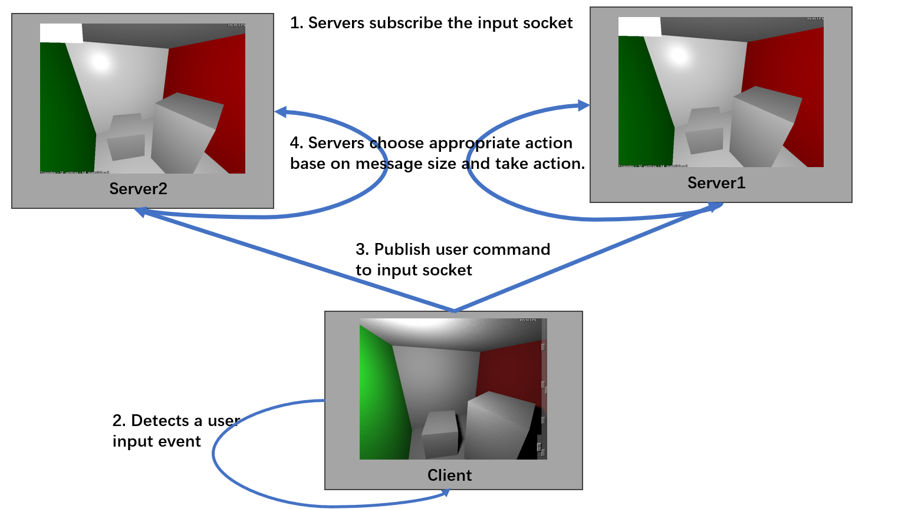

### Server Failure Detection and Pixel Block Reallocation

- Implemented using the Router-Dealer pattern on the monitoring port. The client periodically sends heartbeat messages to all servers listed in its active server array, with a six-second interval between checks.
- Each server responds to the heartbeat message with a "hello" reply.
- The client tracks responses, recording the IDs of servers that reply.
- At the next heartbeat cycle, the client checks whether all servers have responded. If one or more servers fail to reply, they are marked as unresponsive, and the client initiates task reallocation. 
- The client assigns new IDs to the responsive servers and sends the updated IDs and the current count of active servers to all functioning servers. 
- Upon receiving this update, each server adjusts its parameters accordingly, and new pixel blocks are assigned.

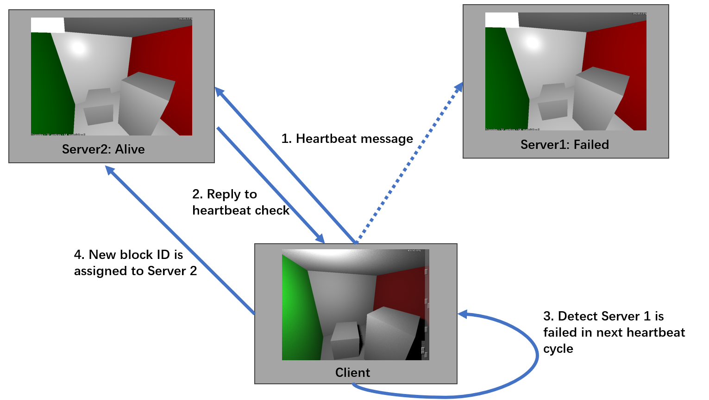

### Final Frame Integration

- Use the Router-Dealer pattern, but through the frame socket. 
- When the client receives the "start tracing" command, it broadcasts all relevant path tracing parameters through the input broadcast socket and begins computing direct lighting locally. 
- Once the local computation is complete, the client starts monitoring the frame socket.
- Upon receiving the command, servers commence path tracing computations for their assigned pixel blocks. 
- After completing indirect lighting computations, servers optionally apply denoising techniques (depending on the parameter settings) and send the processed partial frames to the client via the frame socket. These messages contain the server's identity, allowing the client to associate the received data with the corresponding pixel block. 
- The client then blends the indirect lighting results from the servers with its locally computed direct lighting results.

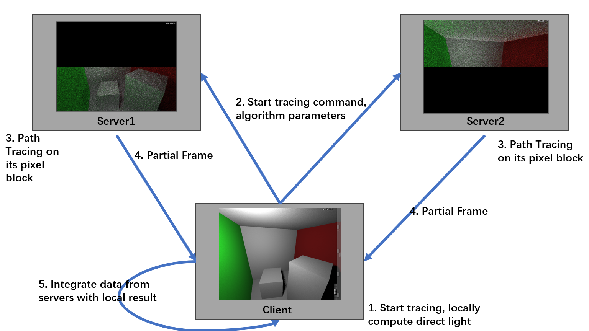

### Implementation and Environment Setup

- Implemented on the CPU, utilizing OpenMP (OMP) for multi-threaded computation to accelerate rendering. 
- Both the client and servers operate on the same machine, which is equipped with an AMD Ryzen 9 7945HX processor and 32GB of RAM.
- Communication between the client and servers is established through the TCP protocol.
- Port 5555 is designated for synchronizing user input.
- Port 5556 is responsible for detecting server connections or disconnections and transmitting the initial state. 
- Frame data is transmitted via port 5557.

### Experiment result

- The reference image was rendered using a single-machine path tracer with 256 samples per pixel to achieve a noise-free image. This process is highly computation-intensive.

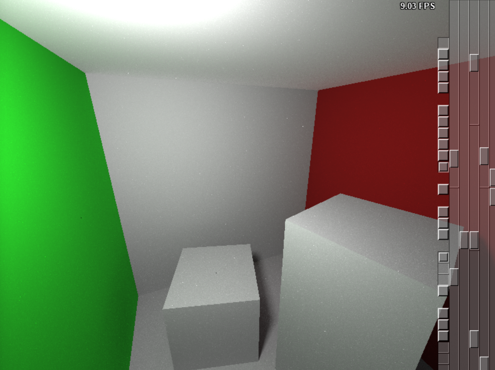

- The result produced by the distributed path tracer client without any server connection. This image includes only the direct lighting contribution.

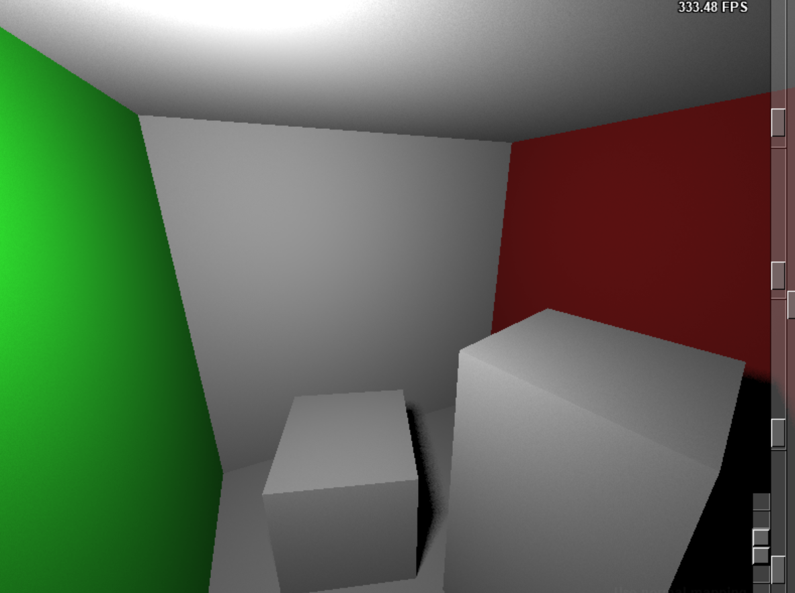

- When a server is connected, the client and server execute their computations independently.

- After the server completes its rendering tasks, the client's rendered image is enhanced with indirect illumination results from the server.

- With more servers connected, the client is capable of broadcasting user input commands to all servers in a synchronized manner.

- Once the client completes its local computation of direct lighting, it waits for the servers to send their results.

- When the servers complete their computations, the final image is integrated by the client. A joint bilateral filter applied on the server side's indirect illumination results effectively reduces image noise with low sample per pixel.

- If a server becomes disconnected, the client detects the failure and redistributes the task to the remaining servers.

- This task distribution strategy, which involves dividing an image into blocks, is applicable to various scene workloads. The following images illustrate the rendering results for different scenes using varying numbers of servers.

- The Rendering Result of Scene Sponza with One Server.

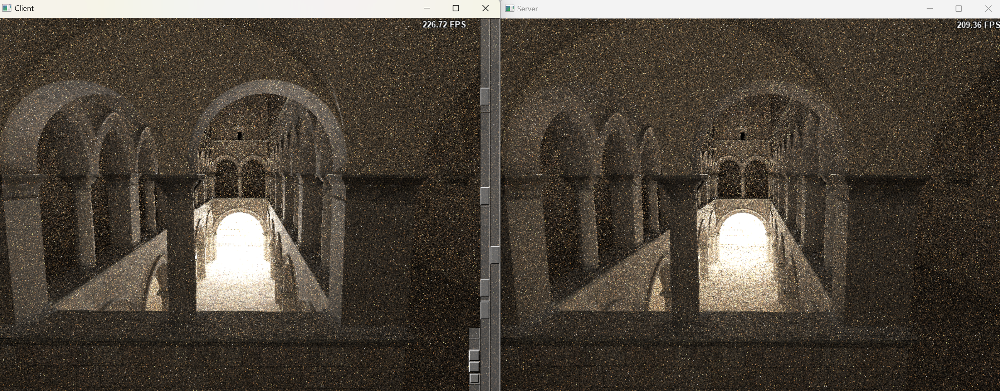

- The Rendering Result of Scene Crytek-Sponza with Two Server.

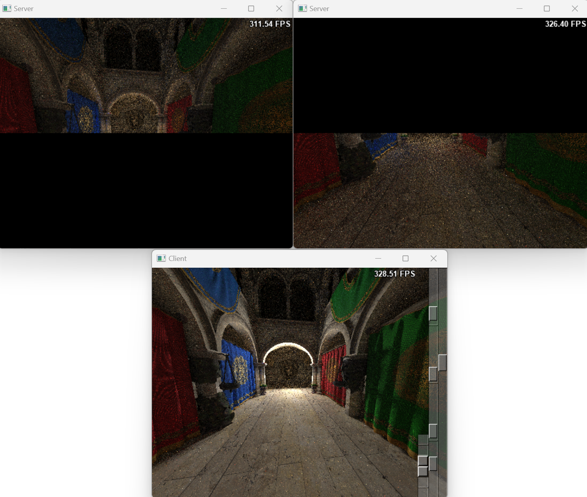

- The Rendering Result of Scene Conference with Three Server.

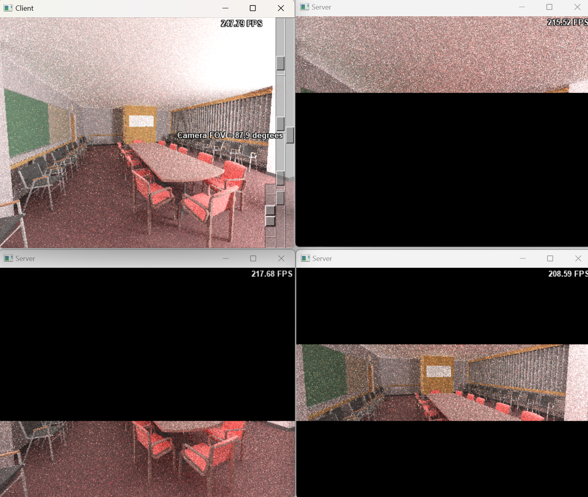

### Discussion

- The current implementation of the distributed path tracer was designed to operate on Windows and was tested on a single machine due to device limitations. This setup inherently constrained the number of rays available for rendering computation. 
- Nevertheless, the experiment successfully validated the feasibility and scalability of the distributed path tracer.
- The client system demonstrated resilience by leveraging local computational capabilities, and maintaining interactivity even without server connections or network connectivity. 
- This capability underscores the importance of fallback mechanisms in ensuring a seamless user experience, particularly in interactive media applications.

### Scalability Analysis

- Later bounces contribute marginally to the final image’s appearance, suggesting that combining direct illumination with a limited degree of global illumination suffices for most practical applications.
- In purely cloud-based rendering systems, the computational burden shifts entirely to the cloud, achieving high-quality visuals at the cost of completely losing application access during network failures.
- This trade-off poses challenges for interactive media, where innovation depends on continuous responsiveness. Hybrid approaches that balance computation between local and cloud systems, coupled with robust fallback mechanisms, represent a promising area for future research.
- From a computational perspective, the time complexity of the path-tracing algorithm can be expressed as follows:
  - For a scene with 𝑇 triangles and a ray with an average depth of 𝐷 bounces, the time complexity per ray is 𝑂(𝐷 · 𝑇).
  - Utilizing an acceleration structure such as a Bounding Volume Hierarchy (BVH) reduces this to 𝑂(𝐷 · log𝑇).
  - For an image with resolution 𝑊 ·𝐻 , the total time complexity for one ray per pixel is 𝑂(𝑊 · 𝐻 · 𝐷 · log𝑇).
- Given a machine with computational capacity 𝐶, the maximum samples per pixel (SPP) is determined by:

- On the client side, where 𝐷 = 1 (direct illumination only), the computational complexity is significantly lower compared to the server, which must process global illumination with 𝐷 bounces. 
- The server’s computational workload is 𝐷 times greater than that of the client. When additional servers are introduced, the rendering workload is distributed across 𝑁 servers, with each server processing a proportional fraction of the image. Consequently, the samples per pixel (SPP) for each server can be expressed as (ignoring the communication cost since this system is targeted to run in LAN environment, where communication is relatively fast):

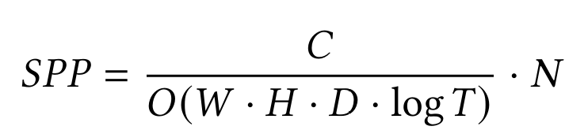

- The workload distribution strategy allows servers to allocate more resources to improving rendering quality by increasing the sampling rate. 
- If the SPP is fixed, by allocating 𝑁 = 𝐷 servers, the computation required for each server is effectively reduced to 1 / 𝑁 of the original workload.
- If the SPP is fixed, allocating 𝑁 = 𝑆𝑃𝑃 · 𝐷 servers effectively reduces the computation per server to 1 / 𝑁 of the original workload. This adjustment aligns each server’s computational time with that of the client processing direct illumination, assuming the client and server have similar computational capabilities. As a result, the servers can complete rendering almost simultaneously with the client, enabling immediate result previews. 
- In practice, servers are typically more powerful than clients, reducing the required number of servers. 
- This system improves the overall fidelity of the image and ensuring scalability as more servers joins.

### Future Improvement

The current implementation is limited to offline rendering scenarios due to the computational complexity of the path tracing algorithm. For real-time rendering, it requires significant improvements:
- Integrate sophisticated global illumination algorithms and advanced computer graphics techniques, such as up-sampling and frame generation, to attain a minimum frame rate of 30 FPS. 
- Transitioning to GPU-based computation and separating computation from display logic are also essential for more efficient task offloading. 
- Predictive techniques will be necessary to reduce the impact of network latency and enhance system responsiveness. 
- Accurate device capability estimation is essential for balanced task distribution and consistent frame rendering.

### Future Methodology RoadMap

- Ray Tracing + Monte Carlo Path Tracing
  - Client calculate the direct illumination while server do the full the Path Tracing. Add barrier between different iteration of bounces and stream the indirect illumination result to Client when one iteration completes.
- Instant Radiosity + Distribute different light computation to different devices
  - Photons are traced from the light source into the scene. Treat path vertices as Virtual Point Lights (VPLs). 
  - Convert indirect illumination computation to direct illumination.
  - Distribute VPLs which belong to different bounces to different devices.

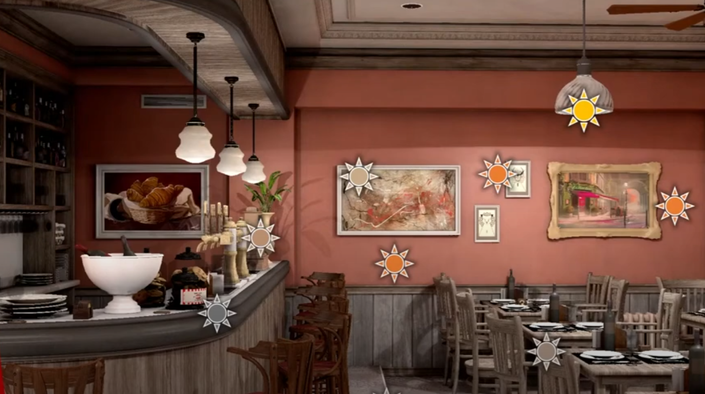

### The Full Report

[A Distributed Path Tracer](/assets/post/2025-01-01-Distributed_Path_Tracer/A_Distributed_Path_Tracer.pdf)

### Project Repository

[Distributed Path Tracing Client](https://github.com/HYJungao/DistributedPathTracingClient)

[Distributed Path Tracing Server](https://github.com/HYJungao/DistributedPathTracingServer)

### Reference

[Ad Hoc Cloud Computing](https://ieeexplore.ieee.org/document/7214163)

[CloudLight: A System for Amortizing Indirect Lighting in Real-Time Rendering](https://research.nvidia.com/publication/2015-10_cloudlight-system-amortizing-indirect-lighting-real-time-rendering)