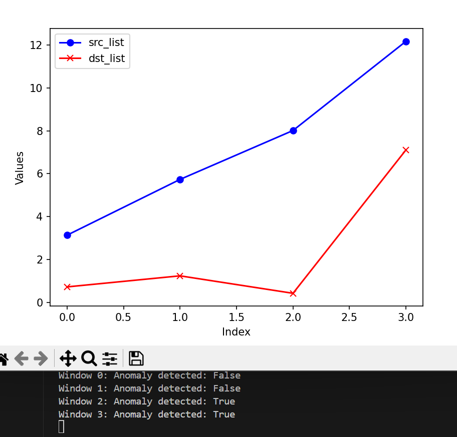

### Eculid

- Euclid is a fully in-network DDoS detection system.
- Offloads both the detection and mitigation algorithms to the data plane.
- Uses Shannon entropy value of IP addresses for detection.
- Entropy values can be calculated from frequency data collected by count-sketches.
- **The intuition: During an attack, entropy of the source IP is expected to increase while entropy of the destination IP is expected to decrease.**
- Flow through the following pipelines:
  - Frequency Approximation
  - Entropy Estimation
  - Traffic Characterization
  - Anomaly Detection
  - Defense-Readiness
  - Frequency Variation Analysis
  - Packet Classification

### Algorithm

1. Divide incoming packets into fixed-size observation windows
2. Compute the frequencies of the source and destination IPs using Count-sketches.
3. Estimate the entropy of the set of IP addresses
4. Compare the entropy measurement with the exponentially weighted moving averages (EWMAs)   and the mean deviations (EWMMDs) measured with previous traffic
5. If the difference crosses a threshold, alarm is triggered
6. Each packet marked as legitimate or suspicious from frequency variation.
7. Apply security policies, such as discarding or throttling applied to suspicious packets.

### Frequency Approximation: Count-Sketch

- Sketch C is a two-dimensional matrix of counters with depth d and width w
- Hash function hi maps addresses to column numbers in row i (hi:X→{1,...,w})
- Hash function gi determines whether the counter Ci,hi(x) should be incremented or decremented (gi:X→{−1,1})

### Entropy Estimation & Traffic Characterization

- Entropy Estimation

- Incremental Update with New Packet

- Traffic Characterization with Exponentially Weighted Moving Averages (EWMAs) and Mean Deviations (EWMMDs)

**Note:**
- Lacking operations (i.e. multiplication, logarithmic, and loop) in programmable switches.
- Adopts the incremental updates mechanism by adding the difference. 
- Defines a pre-computed function and utilizes the longest prefix match lookup table to retrieve final values.

### Anomaly Detection & Defense-Readiness & Frequency Variation Analysis & Packet Classification

- Anomaly occurs when any of the Inequalities Hold

- Frequency Variation Analysis & Packet Classification

- Defense-Readiness State Machine

### Implementation

- Problem
  - Python is inefficient for the same hash function and algorithm as in the original paper
  - Especially when the sketch width increases
- Solution
  - Replace the manual calculated hash function with the python library
  - Only compute hi:X→{1,...,w} and ignore gi:X→{−1,1}

### Experiment

Dataset: CAIDA UCSD DDoS 2007 attack
- Observation window size: 2 ** 14
- Width of the sketch: 1280 
- Depth of the sketch: 4 
- Smoothing coefficient = 20 * 2 ** -8 (EWMAs and EWMMDs)
- Sensitivity coefficient = 3 (Anomaly Detection)
- Mitigation threshold = 96 (Packet Classification)

Result on a small slice of the dataset (time: 20:59:36 to 21:16:18, attack starts around 21:13)

- Window size is adjusted to 2**18.
- Traffic is generated by the first few pcap files of the dataset (too slow to run over the whole dataset)
- There is a burst is the entropy of source IP addresses.
- The Anomaly Detection module reports True after the burst and lasts until the end.

### Motivation of using HyperLoglog

- Shannon entropy requires calculation of deviation and frequencies, which involve computations not easily performed on switches.
- Hyperloglog just requires counting bits to estimate cardinality.
- Attack scenario should show a burst in distinct src IP addresses without change in dst IP addresses.

### Experiment with HyperLoglog

- Observation window size: 2 ** 14
- Cardinality precision: 0.01

The actual counts of source and destination IP addresses are as follows:

Finally, the differences between the actual counts and the HyperLogLog estimates are illustrated here:

The cardinality of source IP address bursts when the attack begins, while the destination IP shows an increase and then stabilizes. The cardinality calculated using HyperLogLog is quite accurate, with the difference between the estimated cardinality and the actual count being less than 5. Given an error rate of 0.01, HyperLogLog requires approximately 12 KB to store the counter, which is acceptable.

For further deployment, additional effort will be needed to adapt other detection mechanisms to this data structure. Moreover, the cardinality calculation involving multiple buckets introduces operations that are not supported by the programmable switch, necessitating extra efforts to optimize the calculation process.

### Experiment with HyperLoglog of one direction (to_victim)

The entropy method:

The actual count:

The hyperloglog:

The difference between actual count and the hyperloglog:

### Extra Findings

In the original experiment with an observation window size of \(2^{18}\) and a cardinality precision of 0.01, we obtained the following results, where the cardinalities of the source and destination sets are similar:

For entropy, we observed that the count of source IP address bursts increases when the attack begins, while the destination IP shows an increase that eventually stabilizes. However, the cardinality of both sets remains similar. This phenomenon could be attributed to the dataset containing traffic in both directions, as the victim responds to the incoming attack requests.

We hypothesized that this result is related to the HyperLogLog algorithm, which hashes IP addresses and counts leading zeros to estimate cardinality. When two sets contain the same elements, they will exhibit the same cardinality, regardless of the differing frequencies of those elements. Consequently, if the victim responds to the attack request even once, the cardinality remains comparable.

I ran this experiment again and noticed that the effectiveness of counting the number of addresses is quite sensitive to the size of the observation window. The following illustrates the results of the entropy method with different observation window sizes:

- Observation window size: 2 ** 14

- Observation window size: 2 ** 15

- Observation window size: 2 ** 16

- Observation window size: 2 ** 17

- Observation window size: 2 ** 18

It is notable that the entropy method exhibits good scalability. As the window size increases, the entropy values become more stable and distinguishable.

The following presents the results obtained with the HyperLogLog method:

- Observation window size: 2 ** 14

- Observation window size: 2 ** 15

- Observation window size: 2 ** 16

- Observation window size: 2 ** 17

- Observation window size: 2 ** 18

Regarding HyperLogLog, we found that the cardinalities of the source and destination addresses become increasingly similar and potentially unusable when the window size grows to 2 ** 16.

As the window becomes larger, more and more servers' responses to attack requests are included in the same window as the attack requests, resulting in similar cardinality in the hyperloglog statistics. However, the entropy method, which calculates frequency, has a greater tolerance for noise flow and stronger robustness.

### Other framework (Jaqen and Patronum)

[A Study on Programmable Switch Enabled Network Defense Methods Against Volumetric Attacks](/assets/post/2025-01-01-Eculid_DDoS_detection/CS540_Midterm_Paper.pdf)

### Project Repository

[Eculid in python](https://github.com/HYJungao/Eculid-in-Py/tree/main)

### Reference

[Euclid: A Fully In-Network, P4-Based Approach for Real-Time DDoS Attack Detection and Mitigation](https://ieeexplore.ieee.org/document/9311137)