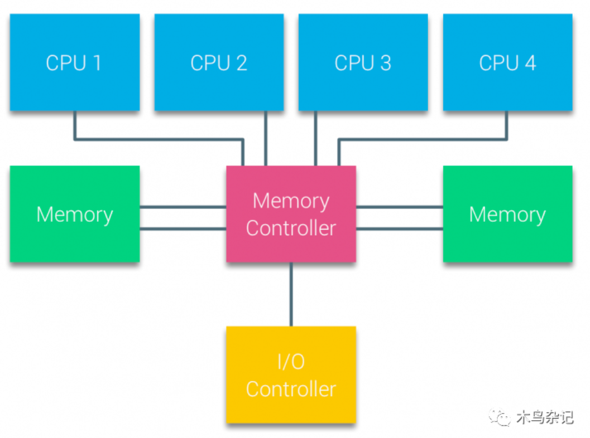
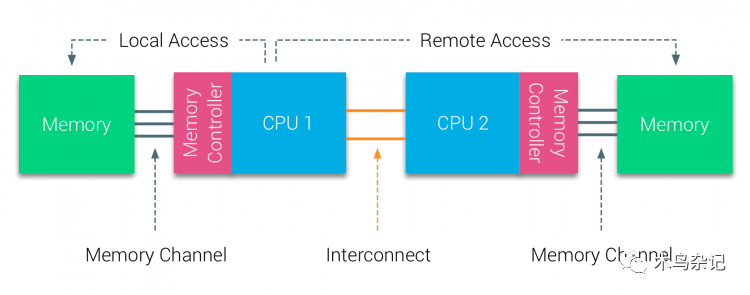
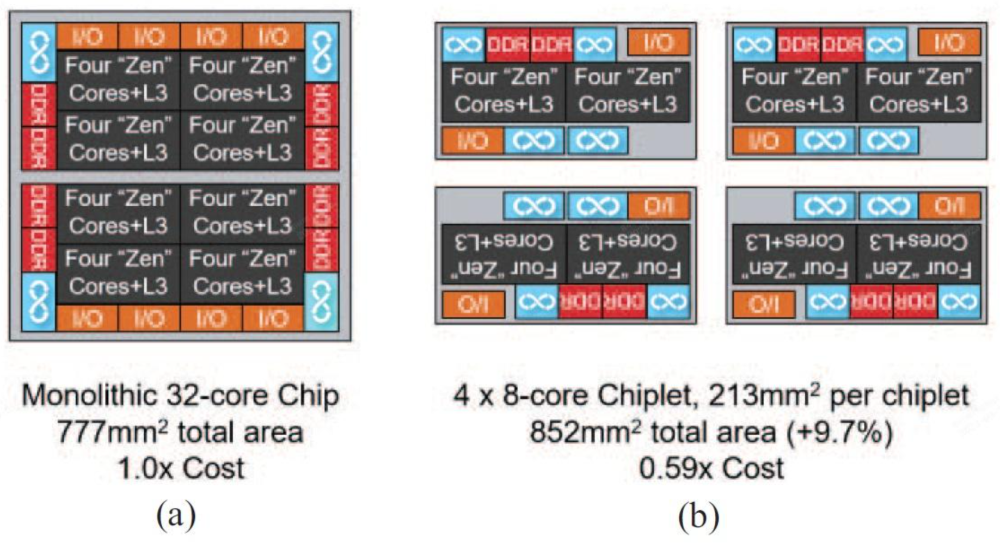
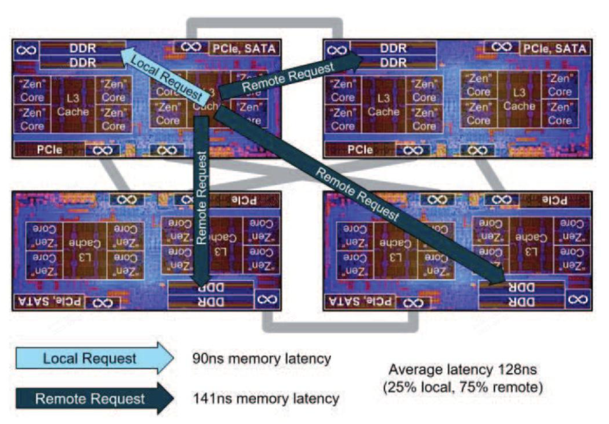
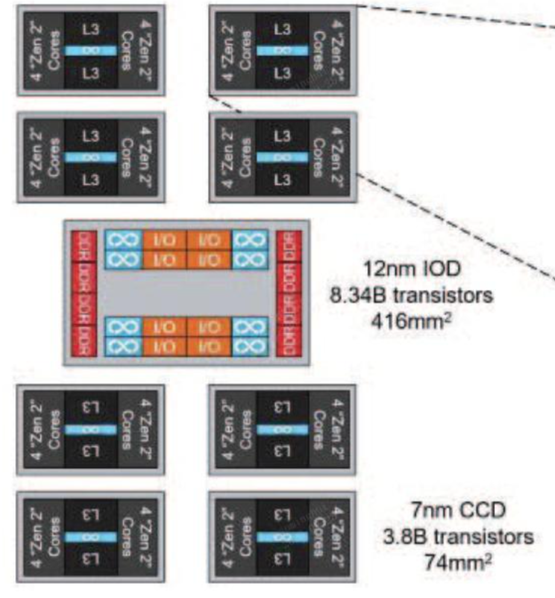
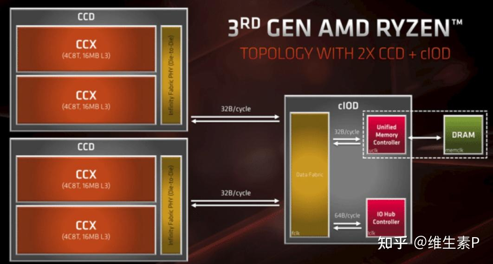
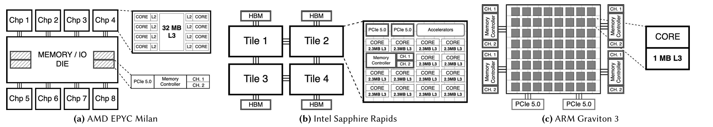
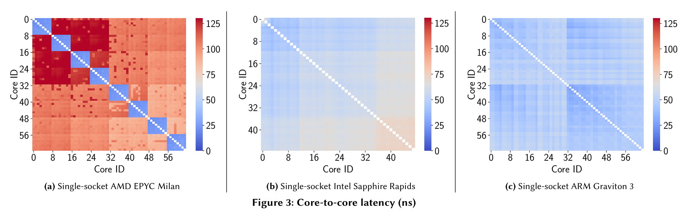
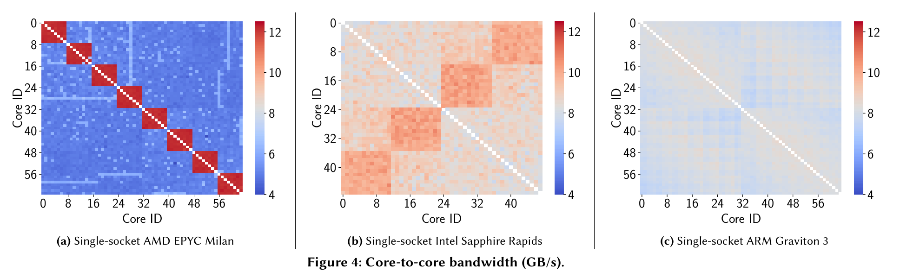
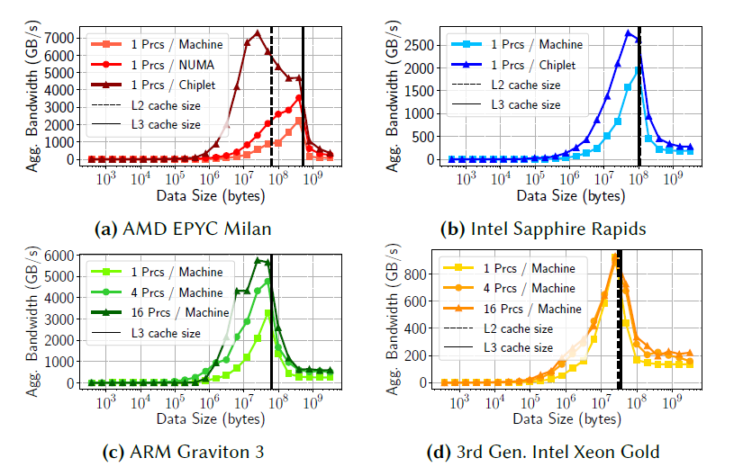

### Chiplet-based CPU
  - The overall idea of a small chip is to divide a typically single-chip SoC into multiple smaller chips or "small chips", and then "re integrate" them with some form of in package interconnect to enable the collective to operate as a single logic SoC.
  - A SoC with T transistors can be divided into n individual chips, such that the combination of these n chips provides equivalent functionality to the original T transistor SoC, and the cost of a single chip plus any additional cost of reintegration (such as additional packaging costs) is still lower than the cost of a single T transistor SoC.
  - The yield of large chips is economically challenging. For the same fault distribution as in the case of a single chip, each potential defect only results in discarding about a quarter of the silicon. These small chips can be tested individually, then reassembled and packaged into a complete final SOC.

### UMA (Uniform Memory Access)
  - All processors access shared memory uniformly, meaning each processor has the same latency when accessing any memory location. Often memory request from all cores go through the same the memory controller.

  

### NUMA (Non-Uniform Memory Access)
  - Memory access time varies depending on the memory location relative to the processor. Each processor has local memory with lower latency and can access remote memory (attached to other processors) with higher latency.

  

### The first generation of AMD EPYC processor (right b)

  

  - Even in the face of some manufacturing defects, a higher proportion of the total number of chips in each wafer can be utilized.
  - With just one chip design (i.e. one mask module, one strip), multiple different products can be provided, which traditionally require multiple independent and unique SOC
  - The Chiplet method makes it more practical to provide products with complete memory and I/O functionality.

  

  - The typical latency measurement for memory requests to local memory channels (i.e., on the same chip) is 90 ns, while accessing remote memory channels (i.e., on different chips, with the same socket) results in a latency of 141 ns. The additional delay is due to the round-trip combination of IFOP links and extra hops through the local data structure (also known as on-chip network or NoC) of each chip.

### The second generation of AMD EPYC processor (a dual chip approach)
  - The first chip is called an I/O chip (IOD), which is implemented using a mature and cost-effective 12nm process.
  - The second chip is the Core Composite Chip (CCD), which is implemented on the leading 7nm technolody.
  - One IOD is assembled with up to eight CCDs. Each CCD provides 8 "Zen 2" CPU cores

  

  - The first generation AMD EPYC processors, with memory and I/O controllers distributed across four chiplets, offers an architecture that requires only a single chiplet design. However, it also introduces in-package NUMA effects. Additionally, the IFOP (Infinity Fabric On-Package) must support requests from a chip to remote memory channels, from remote cores to local memory channels, and I/O in both directions.
  - The overall layout of the second generation AMD EPYC processor's chiplets is similar to a star topology, providing more uniform memory access latency. Each memory request from CCD is directly redirected to IOD, where the high-performance data structure routes the request to one of the eight target memory channels.
  - In the first generation, some memory requests can be served locally on a given chip without any IFOP hops, while in the second generation approach, all requests always require IFOP hops to go from CCD to IOD.

### AMD Zen 3

  

  - Communication between two CCXs: IF bus
  - Communication between two CCDs: CCD <-> IF bus <-> IOD <-> IF bus <-> CCD, which incurs high latency between CCDs

### Different Architecture

- AMD EPYC Milan
  - Eight 7 nm compute chiplets, linked to a 14 nm central I/O die for both memoryandI/O.
  - Innity Fabric technique enables cores to access L3 caches across chiplets at the expense of increased latency.
  - Provide shared access from the I/O die to the memory pool without dedicated DRAM banks per chiplet.
- Intel Sapphire Rapids
  - 4-tile design (XCC-tile architecture)
  - Each tile includes up to 14 cores that are connected to two DDR5 memory channels.
  - The architecture supports 2 MB L2 cache per core, and a shared 28.125 MB L3 cache per tile, amounting to 112.5 MB of combined non-inclusive L3 cache. Similar to AMD Milan, it allows cache access across tiles.
  - Foveros technique for vertical stacking that enables dierent tiles atop one another. Foveros reduces the data travel distance and thus transmission latency.
- ARM Graviton 3
  - Places all 64 cores in a single chiplet.
  - Each core has a separate 1 MB L3 cache, resulting in a combined 64 MB L3 cache.
  - The DDR5 memory controllers and the PCI-Express 5.0 peripheral controllers are located separately from these central cores.
  - Such a design diers from AMD and Intel, where a central I/O and memory die is surrounded by multiple computing chiplets.
  - Core-to-core communication takes place via Low-latency Inter-chiplet Passive Interconnect (LIPINCON), which provides coherent data exchange across the processor.

- AMD processors exhibit varying latencies due to their chiplet design, aecting core-to-core communication and cache access times.
- Intel Sapphire Rapids and ARM Graviton processors achieve consistent latency by avoiding shared caches between cores.
- ARM CPU minimizes latency by using a single computing chiplet, eliminating cross-chiplet communication. Intel reduces latency in its designs with Foveros technology, which employs vertical stacking to shorten distances between chiplets.

### Aggregate memory bandwidth

- As the array size increases, the three chiplet-based processors exhibit higher aggregate bandwidths when utilizing multiple processes.
- The AMD Milan and Intel Sapphire Rapids display the highest aggregate bandwidths using one process per chiplet.
- The aggregate bandwidth of ARM demonstrates that using multiple processes can increase aggregate bandwidth, even with a single chiplet, due to the partitioned L3 cache at the core level.
- The Intel Xeon Gold, featuring a monolithic processor design, stands out as the exception, displaying no variation in performance across dierent congurations, underscoring a distinct behavior from chiplet-based processors.
- Directing tasks to specic core subsets presents a trade-off: in chiplet-based architectures: on one hand, it reduces the available L3 cache, which may be a concern for bandwidth-intensive workloads; on the other hand, our ndings indicate that this approach can increase the aggregate bandwidth in chiplet-based architectures. The key factor is more ecient cache use and improved data locality.

### Design space overview and trade-offs

- WIM: Single-Worker Instance per Machine
  - The implementation is independent from the physical system architecture. Threads have the entire L3 cache at their disposal to store and access data eciently. Moreover, with just a single database worker instance for each machine in the cluster, communication between nodes is minimized.
  - Maximizing data and thread locality is non-trivial. Inadequate allocation of data between the chiplets’ L3 caches risks congesting interconnects, leading to performance reductions.
- WIN: Single-Worker Instance perNUMA
  - Avoid memory accesses across NUMA nodes and avoids interconnect congestion. The work is partitioned by the database engine, thus generating a fair use of the resources shared in NUMA domains.
  - Communication variability can be significant even within a NUMA domain. An instance may experience higher latency when accessing memory located on a different chiplet within the same NUMA domain. The number of chiplets can also be high, and managing memory across multiple chiplets can be complex. Ensuring good cache locality may require a chiplet-aware scheduling policy, which adds overhead and complexity to system operation. In addition, local inter-worker communication takes place via the network stack with less bandwidth than what can be achieved through interconnects. A larger number of database worker instances increases inter-machine communication.
- WICP: Single-Worker Instance per Chiplet
  - By dedicating a database worker instance to each chiplet, Single-Worker Instance per Chiplet oers a localized approach that can minimize inter-core latency and increase inter-core bandwidth for machines with high heterogeneity in core-to-core communication. With each instance working on its own cache, the WICP design eliminates cross-chiplet communication and favors a more balanced data allocation, avoiding congestion of the interconnect.
  - By forcing instances to run on a specic subset of cores, we can restrict their memory bandwidth. Moreover, by forcing a worker instance to use only a single chiplet’s cores, we limit the access to other chiplets’ L3 caches, thereby shrinking the available cache size and necessitating slower main memory use for data exceeding the local cache capacity. The high number of chiplets, even within a single NUMA node, could lead to signicant overhead in ensuring data consistency and synchronization across them.
- WIC: Single-Worker Instance per CPU Core
  - The policy provides improved data and thread placement. It prevents cores from communicating through the interconnect and thus avoids potential congestion. As a result, WIC-based systems exhibit good single-thread performance.
  - The WIC deployment policy increases the amount of communication and data exchange required for data processing. In addition, as with WICP, each process is limited to using only the relevant cache partition available in its chiplet.

