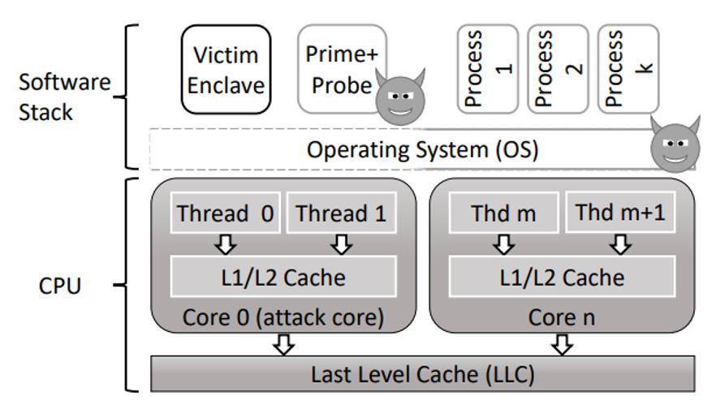
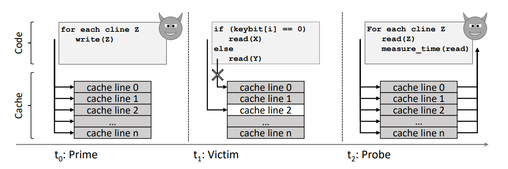
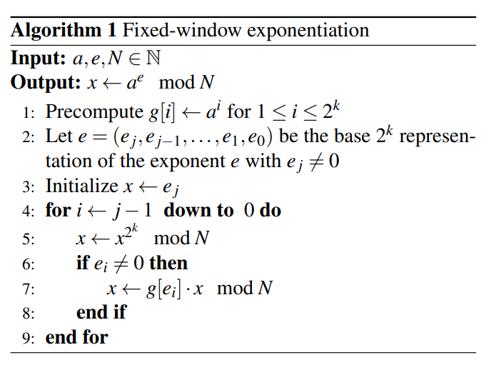
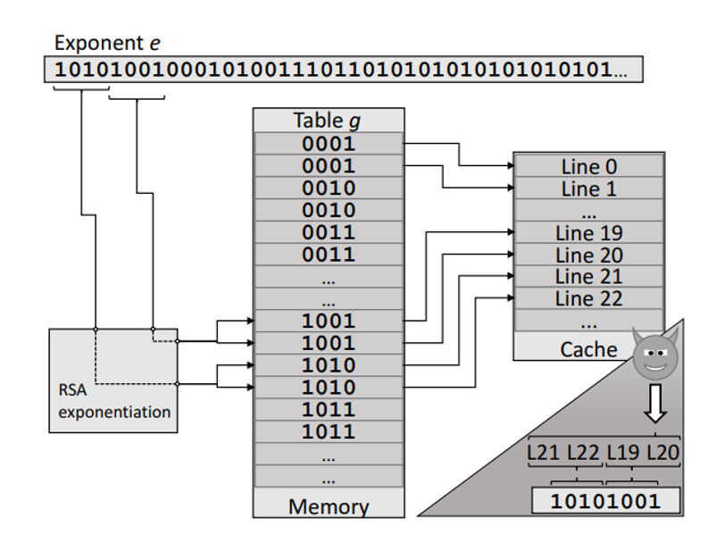
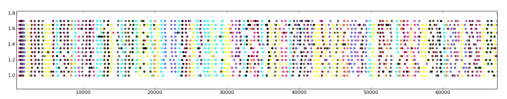
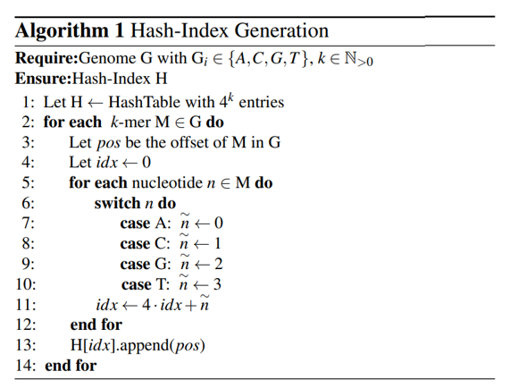
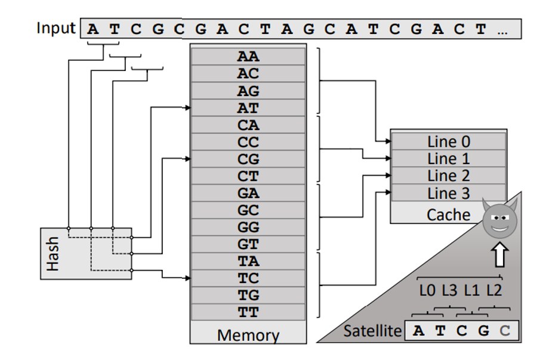
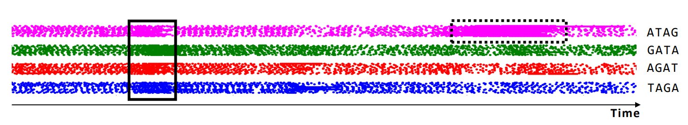

### Introduction

- Intel Software Guard Extensions (SGX) enables secure execution of sensitive application code (enclaves) by isolating it from untrusted system software.
- SGX provides protections in the CPU processor to prevent a malicious OS from directly reading or modifying enclave memory at runtime. 
- Useful in cloud computing applications, where data and computation is outsourced to an external computing infrastructure without having to fully trust the cloud provider and the entire software stack.

### Challenge

- SGX can be attacked by exploiting information leakage through various (software) side-channels. 
- Page-faults based attack: The untrusted OS manages the memory (including paging), so it can force page faults during enclave execution and learn the enclave control flow or data access patterns from the requested pages.
- Cache based attack: Oversee caches shared between the enclave and the untrusted software.

### Intel SGX -- enables persistent secure storage of data

- Introduce a set of CPU instructions for managing software components (enclaves), that are isolated from all software including privileged software like OS and the hypervisor. 
- Assume the CPU to be the only trustworthy component. Data is stored unencrypted in the CPU's caches and registers. When data is moved out of the CPU, it is encrypted and integrity protected. 
- The untrusted OS is responsible for creating and managing enclaves, including allocating memory, managing address translation and coping the initial data and code into the enclave. 
- All actions of the OS are recorded securely by SGX and can be verified by an external party through (remote) attestation. 
- The OS can interrupt and resume the enclave like a normal process. SGX handles the context saving and erases the register content before passing control to the OS (AEX: asynchronous enclave exit).

### Cache Architecture

- Caches store data to reduce memory access latency, serving requests from the cache (cache hit) or DRAM (cache miss).
- Cache lines map to memory addresses, and multiple addresses can conflict in the same line, leading to evictions.
- Set-associative caches reduce conflicts by allowing multiple copies of cache lines (cache sets).
- The controller aims to maximize cache hit rates to optimize performance.
- L1 cache is dedicated to each CPU core for data and instructions; L2 and L3 caches are shared among cores, with L3 being shared across all cores.
- L1 cache is the separated into data and instruction cache while the L2 and L3 caches are shared by code and data.

### Performance Monitoring Counters

- Performance Monitoring Counters (PMCs) are used to record hardware events, providing insights how programs interact with the hardware to optimize performance.
- PMCs can monitor various events, such as executed cycles, cache hits/misses and are configured by writing to model-specific registers (MSRs), which require privileged access.
- The RDPMC instruction is used to read PMCs, and it can be configured for access in unprivileged mode.
- PMCs can be exploited as side-channels to monitor sensitive information (e.g., cache hits/misses), which could compromise security.
- SGX enclaves can disable PMCs upon entry by activating "Anti Side-channel Interference" (ASCI), preventing hardware events triggered by the enclave, such as cache misses, from being recorded.

### System and Adversary Model

- The enclave runs on a compromised OS, sharing a CPU core with an attacker process.
- Attack objective: learn secret information from the enclave. 
- Attacker capability: has control of all system software (except for the software executed inside the enclave), know the initial state of the enclave, address space layout randomization (ASLR), reinitialize the enclave and replay inputs, control over the allocation of resources (time of execution, CPU core), define the system's behavior on interrupts.
- Attack strategy. learn about the victim's cache usage by observing effects on the cache availability to its own program and leveraging the knowledge of the mapping of cache lines to memory locations.

### Prime + Probe

- Time t0:  Attacker primes the cache (make entire cache filled with data of the attacker process)
- Time t1: Victim executes code with memory accesses that are dependent on the victim’s sensitive data, like a cryptographic key.
- Time t2: Attacker probes which of his cache lines got evicted by measuring access times (If the data are still in the cache, the read operation returns them fast, if it takes longer, the data were evicted.
- The attacker knows the code and access pattern of the victim, as well as the key-bits & memory mapping. Repeat the cycle  for each sensitive key-bit until the attacker learns the entire key.

### Prime + Probe for SGX

Classical techniques experience significant noise, which requires thousands and even millions of repeated executions.
- Perquisites:
  - Build an attack that cannot be easily detected using the recently proposed detection approaches.
  - The adversary is the privileged OS, which enables novel attach techniques.
- Challenges:
  - Minimizing cache pollution caused by other tasks.
  - Minimizing cache pollution by the victim itself.
  - Uninterrupted victim execution to counter side channel protection techniques and prevent cache pollution by the OS.
  - Reliably identifying cache evictions.
  - Performing cache monitoring at a high frequency.

### Noise Reduction Techniques

- Isolated attack core: 
  - Isolate the victim enclave on a dedicated CPU core, which only executes the victim and our attacker Prime + Probe code.
- Self-pollution: 
  - The attacker observes specific cache lines that correspond to memory locations with sensitive data. It is undesirable if those cache lines are used by the victim for any other reason. L1 cache is divided into a data cache and an instruction cache. 
  - Code accesses will not cause pollution while unrelated data accesses pollution is inevitable.
- Uninterrupted execution: 
  - When an enclave is interrupted, an asynchronous enclave exit (AEX) is performed and the OS’s interrupt service routine (ISR) in invoked, which both induce noise. Transactional memory accesses of an enclave can detect that it has been interrupted, which is useful for side channel defense mechanism.
  - Configure the interrupt controller such that interrupts are not delivered to the attack core. The CPU timer interrupt frequency of the attack core has reduced to 100Hz, which allows 10ms uninterrupted attack time frame.
- Monitoring cache evictions:  
  - Timing-based measurements represent another source of noise. L1 cache miss may be served by L2 cache, which makes it challenging to distinguish a cache hit/miss.
  - Use Performance Monitoring Counters (PMC) to determine if a cache line got evicted. Anti Side Channel Interference (ASCI) feature, which prevents monitoring of cache related events of enclave is not effective here because we observe cache events of the attacker process.
- Monitoring frequency:
  - High priming and probing frequency is needed, but it is expensive.
  - Monitor individual (or a small subset of) the cache lines. Run multiple execution and align the results of all runs.

### Attack Instantiations -- RSA attack

- The attacked decryption variant is a fixed-size sliding window exponentiation. An RSA key size of 2048 bits is used.
- The first step is a pre-computation of a multiplier table g from the base value a.
- The exponent is divided into [n/k] windows (ej, ej−1,..., e1, e0) of fixed size k bits each.
- Iterates over all exponent windows starting from the most significant window (line 4) and, depending on the window value, it may perform a multiplication with a value from the multiplier table g.
- The processed window value determines which pre-computed multiplier is accessed from the table g on each iteration (line 7).

- Monitor a single multiplier access at a time. 
- Each pre-computed multiplier is 1024 bits, this memory range corresponds to two cache sets (a cache line is 64B).
- Probe two monitored cache sets every c cycles and divide the observed memory accesses into epochs of p probes.
- Each multiplier in the table is 1024 bits, accessing the multiplier causes 16 repeated memory accesses (1024b = 128B, data bus width = 64b = 8B). Observe 16 repeated accesses within one epoch, mark the multiplier as a potential access candidate.
- Repeat this process for a subset of all possible multipliers (10 out of 16).
- Not to monitor cache sets with significant cache access interference.
- Repeat the entire process t times.

- Each dot represents 16 repeated memory accesses that correspond to a single multiplier.
- Each horizontal row represents one complete monitoring round.
- t = 15 times = 15 horizontal lines
- Most multiplier accesses are clearly distinguishable as separate colored vertical lines.
- Recover the multiplier access pattern by analyze plot manually:  if more than half of the monitoring have the same value for the same epoch, consider this value the accessed multiplier. If no multiplier accesses in one epoch, the exponent window for this iteration of exponentiation was zero (line 6).
- Attack extracts 70% of the key bits correctly, which matches with the fraction of monitored cache sets (10+1) /16 = 0.69. (+1 comes from the fact that the exponent windows value zero we learn without monitoring)

### Attack Instantiations -- Genomic attack

- Genome data is highly sensitive, as they may allow the identification of persons.
- Genome sequences are represented by the order of the four nucleotides adenine, cytosine, guanine and thymine (A, C, G, T).
- Microsatellites or short tandem repeats (STR) are repetitive nucleotides base sequences.
- The length of the microsatellite at specific locations are used to identify an individual.
- Preprocess to divide the genome sequence into substrings of a fixed length k, called k-mer. The k-mers represent a sliding window over the input string of genome bases.
- The k-mers are inserted into a hash table, which stores the position or other statistics.

- Observe cache activities that can be linked to the victim’s insertion operation into the hash table.
- From the source code we learn the hash function used to determine the table index for each k-mer, and by reversing this mapping to infer the input.
- Individual table entries do not map to unique cache lines. Multiple table entries fit within one cache line.
- Split up the microsatellite is interested in into k-mers and determine which cache lines will be used when it appears in the input sequence.

- Chose k = 4 for the k-mers leading to 44 = 256 4-mers. Each 4-mer is represented by a unique table entry, each table entry is a pointer (8byte), and thus each cache line contains 64byte/8byte = 8 table entries.
- Try to extract the length of the expected repeating sequence TAGA. For each 4-mer the corresponding cache lines: TAGA ⇒ cache line 7; AGAT ⇒ cache line 28; GATA ⇒ cache line 9; ATAG ⇒ cache line 20.
- Monitor these four cache lines individually and align them. When the microsatellite appears in the input string, the cache lines 7, 28, 9 and 20 will all be used repeatedly (solid line rectangle).

- False positives due to monitoring noise are very unlikely due to the fact that we are observing four cache lines (dashed line rectangle).
- Unable to extract precise microsatellite lengths. Through a manual verification it is confirmed that the attack is able to extract the length with an accuracy of ±1 in the vast majority of test samples.
- Given the three possible lengths for each standard location, one can compute the probability that a random person from a given population would match the leaked genomic information. In the worst case, from a population of 10 million people, statistically 703 people would have a genotype that matches the information leaked through the attack. In the majority of cases, statistically less than one person from a population of 10 million match the leaked information. 

**Note: There may be some errors in the analysis of the false positive rate. The strategy used in the attack involves breaking the microsatellite of interest into k-mers and determining which cache lines will be accessed when it appears in the input sequence. The author claims that the false positive rate is low because multiple cache lines are monitored simultaneously. However, observing repeated access to specific cache lines does not necessarily indicate that the sequence actually contains the microsatellite we are interested in.**

**For example, consider the following cache line mapping:**
- Cache line 1: A B C D
- Cache line 2: E F G H
- Cache line 3: I J K L

**If we are interested in the sequence AIE, and we observe repeated access to cache lines 1, 3, and 2, this does not confirm that the actual sequence is AIE. It might instead be AJF, which also accesses cache lines 1, 3, and 2 repeatedly.**

### Countermeasure Analysis

- Cache disabling: 
  - Lead to severe performance degradation.
- Architectural changes to cache organization: 
  - Access randomization within cache memory or cache partitioning (security sensitive code never shares caches with untrusted processes). 
  - Can only be incorporated by hardware manufacturers, which is hard to achieve in practice.
- Obfuscation techniques: 
  - Oblivious RAM (ORAM) hides memory access patterns of programs by continuously shuffling and re-encrypting data as they are accessed. Typically applied in server-client models, and requires the client to store some state that is updated throughout the execution.
  - Not directly applicable, as it is challenging to store ORAM-internal state securely.
- Application hardening:
  - Side-channel free implementation: Scatter-gather techniques are application-specific and require significant manual effort and expert knowledge.
  - Automated transformation tools: Make attacks harder but not impossible or target only a specific type of side-channel attacks.
- Randomization:
  - SGX Shield concentrates on randomization of code, but does not randomize data.
  - Randomization of data segments is challenging due to dynamic data allocations.
- Attack detection:
  - Attacker controls OS and has sufficient privileges to disable any monitoring at system level.

### Reference

[Software Grand Exposure: SGX Cache Attacks Are Practical](https://arxiv.org/abs/1702.07521)

