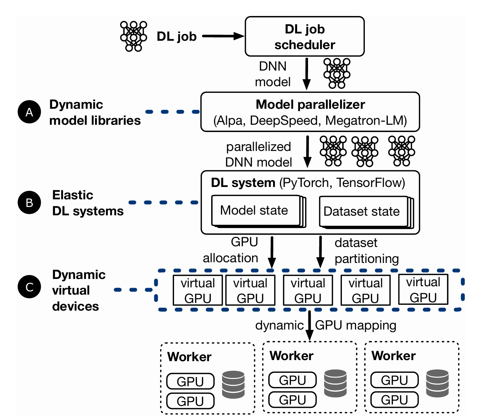
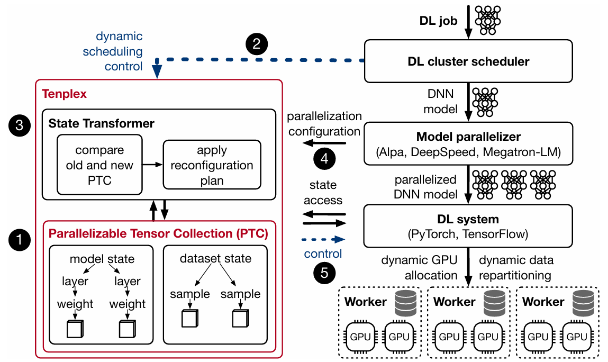
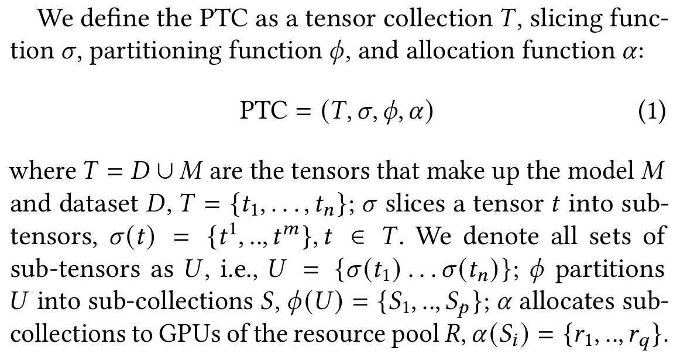
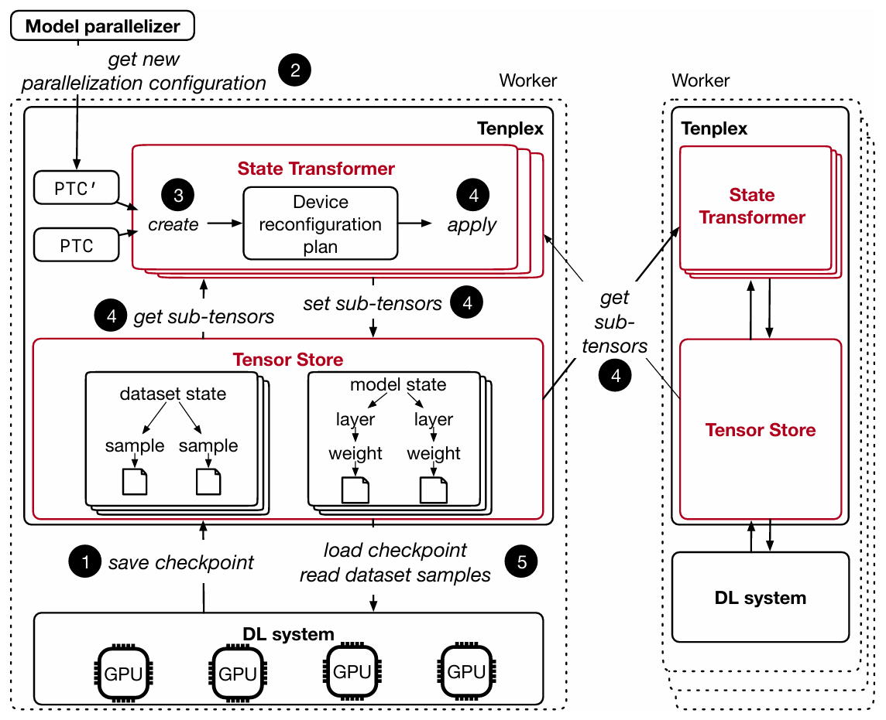

### Need for dynamic resource changes

- Elasticity: Elastically increase and decrease the allocated GPUs for a job based on the available resources.
- Redeployment: Reallocate jobs to a new set of GPUs for operational reasons.
- Failure recovery: In some cases, the failed worker or GPUs can be replaced by new resources before resuming the job; in other cases,the job can resume with fewer GPUs.

### Challenges when changing GPU resources

- Impact on convergence
  - In today’s DL systems,job convergence depends on the specific set of GPU sused, as current jobs are not device-independent.
  - Consistency of training dataset: A DL job must maintain dataset consistency during training,i.e.,it must process training data samples exactly once and in a consistent order in each training epoch. Otherwise, the distribution of the dataset will change and the model changes.
  - Consistency of hyper-parameters: Hyper-parameter choices, such as batch sizes, and learning rate, depend on the GPU resources of a job.
- Impact on performance
  - Parallelization configuration: The best multi-dimensional parallelization depend so nmany factors, including the number and type of GPUs, the bandwidth and latency of the GPU interconnect and the network between workers,and the size and structure of the DNN model architecture. When the GPU resources of a DL job change at runtime, a parallelization configuration that was optimal at deployment time may no longer be optimal with the new GPUs.
  - Reconfiguration cost: The state must be re-partitioned and the new partitions must be sent to workers, which may involve large data movement.

### Current approaches

- DL job scheduler: Manages the GPUs and assigns jobs to them.
- Model parallelizer: Decides on a parallelization configuration for the job.
- DL system: Perform the DNN model training on the GPU cluster.
- Virtual devices: Make DL jobs device-independent by virtualizing resources and allowing the mapping between virtual/physical resources to change at runtime.

### Tenplex Design

Add a new abstraction layer parallelizable tensor collection (PTC) to achieve dynamic reconfiguration.

- Parallelizable Tensor Collection
  - Slicing: Encodes how tensors are split into sub-tensors, as dictated by tensor parallelism.
  - Partitioning: Groups these sub-tensors into collections that can be assigned to devices, capturing data and pipeline parallelism.
  - Allocation: Maps these sub-tensor collections to GPU devices for execution.

  

- Reconfiguration plan
  - Tenplex decides how to reconfigure a DL job by computing a “delta” between the two PTCs.
  - If the sub-tensors 𝑈 of PTC and 𝑈′ of PTC′are different, a split operation slices the sub-tensors according to the current slicing function 𝜎 and the new𝜎′.
  - A re-partition operations move the split tensors from a previous GPU 𝑅 to 𝑅′.
  - If sub-tensors were previously split but are now on the same GPU, a merge operation combines them again to reflect 𝜎′.

### Tenplex Architecture

- State Transformer
  - When the resources of a DL job change, Tenplex must create new state partitions based on the updated parallelization plan so that the DL system can resume executing the job.
  - Maintains an instance of the State Transformer for each resource 𝑟 on a worker.
- Tensor Store
  - Each worker has an in-memory Tensor Store that contains the model and dataset partitions for each local GPU.
  - Maintains the model and dataset tensors in a hierarchical in-memory file system.
  - The tree hierarchy follows the model structure, with model parameters and dataset samples as leaves.
- Fault tolerance
  - Avoid re-executing training steps due to stale checkpoints: for DL jobs with data parallelism, Tenplex exploits that the model state is replicated among workers. As long as at least one model replica remains after a failure, the state can be retrieved from that GPU.
  - For clusters, replicate the model state in the Tensor Store across workers in a round-robin fashion. If a worker fails and the state in the worker’s Tensor Store is lost, the state can be recovered from another worker.