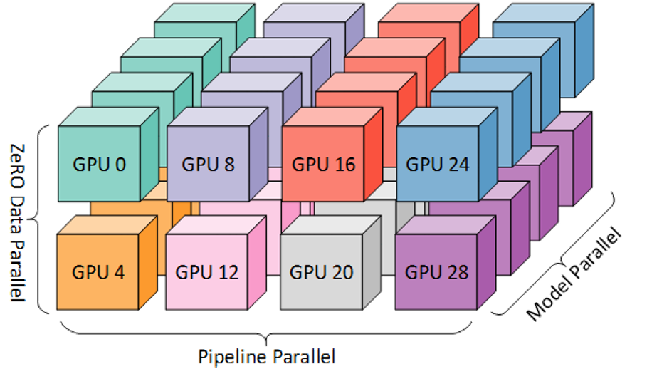
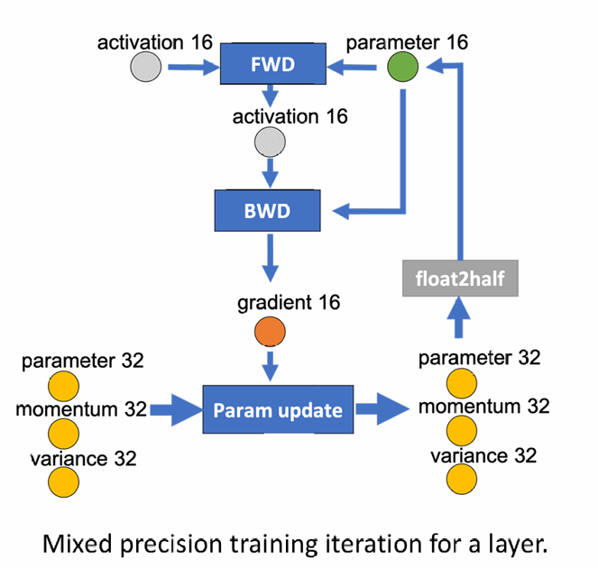
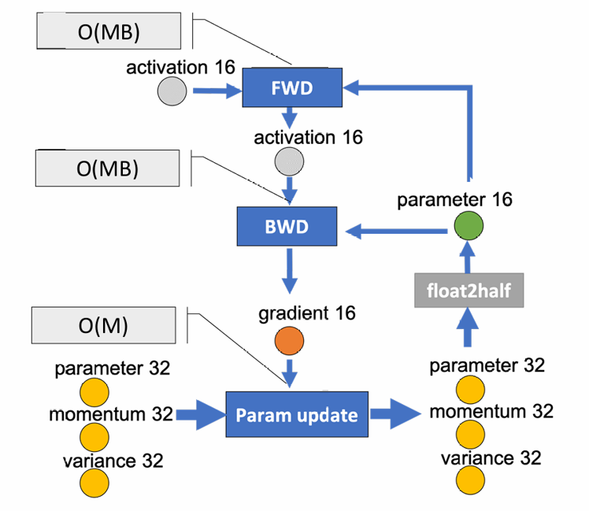
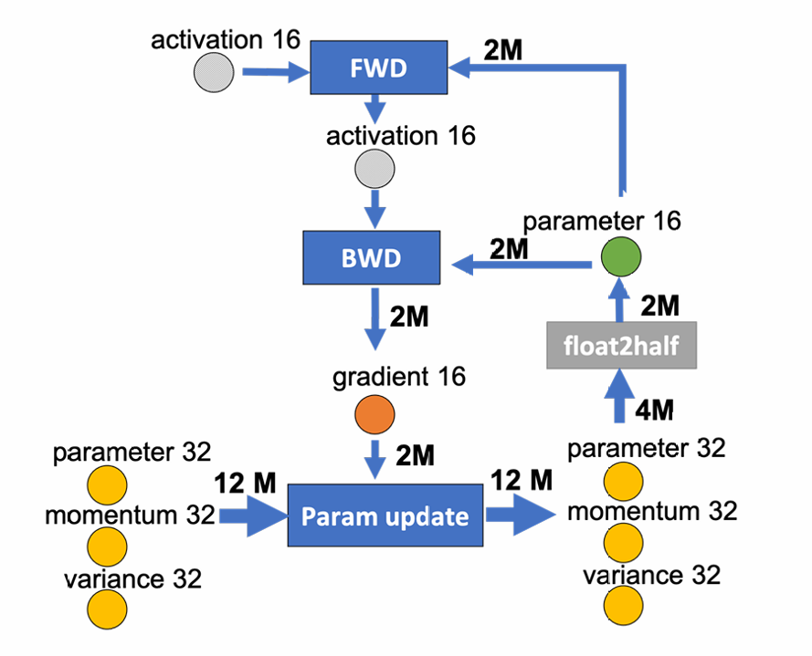
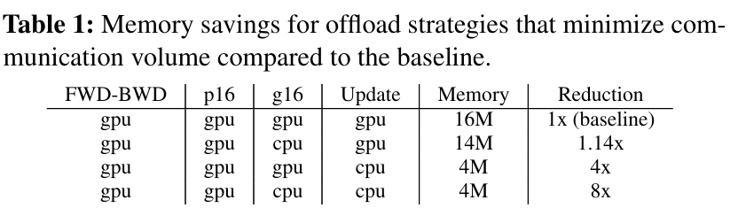
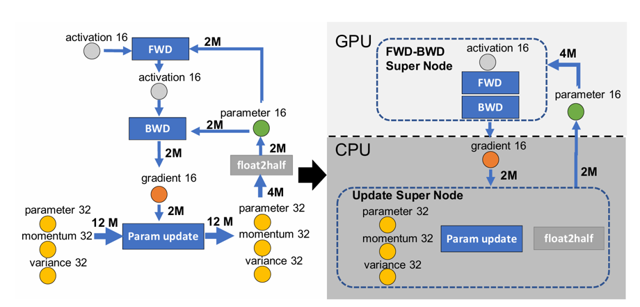
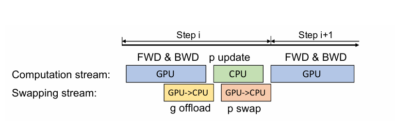
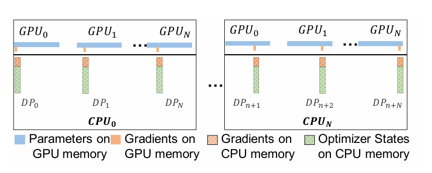
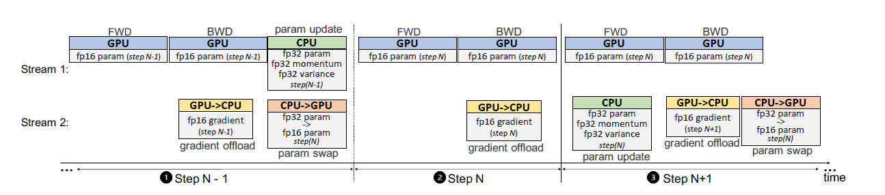

## Repository

[ZeRO-Offload: Democratizing Billion-Scale Model Training](https://arxiv.org/abs/2101.06840)

### Large model training--Scale out

- Use aggregate memory of multiple GPUs to satisfy the memory requirement.
- Model parallelism partitions the model vertically and distributes the model partitions to multiple GPU devices. Pipeline parallelism parallelizes model training by partitioning the model horizontally across layers.
- ZeRO splits the training batch across multiple GPUs similar to data parallel training, and  partitions model states across all GPUs, and uses communication collectives to gather individual parameters as needed during the training.
- **All require multiple GPUs such that the aggregate GPU memory can hold the model and residual states.**

### Large model training--Scale up
- Trades computation for memory saving from activations (residual memory) by recomputing from checkpoints.
- Use compression techniques such as using low or mixed precision for model training, saving on both model states and activations. 
- Heterogeneous DL training: Use an external memory such as the CPU memory as an extension. Offload tensors from GPU memory to CPU memory when tensors are not used in computation. Prefetch tensors from CPU memory to GPU memory before computation happens.
- **Only exploit CPU memory not CPU compute**

### Unique Optimal Offload Strategy
- Model the DL training as data-flow graph and partition this graph between CPU and GPU devices
- Require orders-of magnitude fewer computation on CPU compared to GPU, preventing CPU from becoming a performance bottleneck.
- Guarantees the minimization of communication volume between CPU and GPU memory
- Maximizes the memory savings while achieving minimum communication volume

### DL Training as a Data-Flow Graph
- Represent as a weighted directed graph of data and computation. 
- The circular nodes represents model states (parameter16, gradient16, parameter32, momentum32, variance32). The rectangular nodes represents computation (forward, backward, param update). 
- The edges represents the data flow between the nodes, and the weight of an edge is the total data volume in bytes that flows through it during any given training iteration.
- An offload strategy can be represented a two-way partitioning of this graph, such that computation nodes in a partition would be executed on the device that owns the partition, and the data nodes in the partition will be stored on device that owns the partition. The total data volume that must be communicated between GPU and CPU is given by the weight of edges running across two partitions.

### Limiting CPU Computation
- The CPU computation throughput is multiple orders of magnitude slower than the GPU computation throughput. Avoid offloading compute intensive components to the CPU.
- The compute complexity of DL training per iteration is generally given by O(MB), where M is the model size and B is the effective batch size. Only those computations that have a compute complexity lower than O(MB) should be offloaded to CPU. 
- Forward propagation and backward propagation both of which have a compute complexity of O(MB): on GPU.
- Remaining computations such as norm calculations, weight updates etc that have a complexity of O(M): offloaded to CPU.

### Minimizing Communication Volume
- CPU memory bandwidth is faster than the PCI-E bandwidth. GPU memory is faster than the CPU memory. Minimize the communication volume between CPU and GPU memory to prevent the PCI-E bandwidth from becoming a bottleneck. 
- Any partitioning of this graph would require cutting at least two edges, each of which has an edge weight of at least 2M.
- The minimum communication volume for any model-state offload strategy is 4M.

### Maximizing Memory Savings
- Only g16 and Update Super Node remain to be assigned.
- All partitions will result in minimum communication volume.
- Table 1 shows the memory savings of all valid partitioning strategies that minimize the communication volume. 
- Allocate all the fp32 model states along with the fp16 gradients on the CPU memory & Compute the parameter updates on CPU.
- The fp16 parameters are kept on GPU & the forward and backward computations are done on GPU.

### Single GPU Schedule
- Forward propagation: fp16 parameters are on GPU, no CPU communication is required. 
- Backward propagation: gradients for different parameters are computed at different point. Transfer these gradients for each parameter individually or in small groups to the CPU memory immediately after they are computed.
- Only a small amount of memory temporarily holds the gradients on the GPU memory before they are transferred to CPU memory.
- Each gradient transfer can be overlapped with the back propagation on the remainder of the backward graph.

### Multi-GPUs Schedule

- Preserve the partitioning strategy of ZeRO-2 (optimizer state and gradient partitioning). Offload the partitioned gradients, optimizer states and the corresponding parameter updates to CPU. 
- For systems with more than 1 GPU, each data parallel process is only responsible for updating a subset of the parameters. The aggregated communication volume from all the data parallel GPUs to CPU remains constant.
- Since the CPU compute resources increase linearly with the increase in the number of compute nodes, the total CPU update time decreases with increased data parallelism.

### Optimized CPU Execution
- A faster implementation of Adam optimizer on CPU
- SIMD vector instruction: Fully exploit the hardware parallelism supported on CPU architectures. 
- Loop unrolling: Increase instruction level parallelism.
- OMP multithreading: Utilization of multiple cores and threads on the CPU in parallel.

### One-Step Delayed Parameter Update
- **CPU computation overhead can become a bottleneck during training with very small batch sizes, when the GPU computation time is not much larger than CPU compute.**

- One-step delayed parameter update (DPU) that overlaps CPU and GPU compute to hide the CPU computation overhead by delaying the parameter update by a single step.
- The first N-1 steps: trained without DPU to avoid destabilizing the training during the early stages where gradients change rapidly. 
- Step N:  Obtain the gradients from the GPU, but skip the CPU optimizer step, and do not update the fp16 parameters on the GPU either. 
- Step N +1: Compute the parameter updates on the CPU using gradients from step N, while computing the forward and backward pass on the GPU in parallel using parameters updated at step N-1. 
- The model at (i+1) step will be trained using the parameters updated with gradients from (i-1) step instead of parameters updated at i step, overlapping CPU compute with GPU compute.

