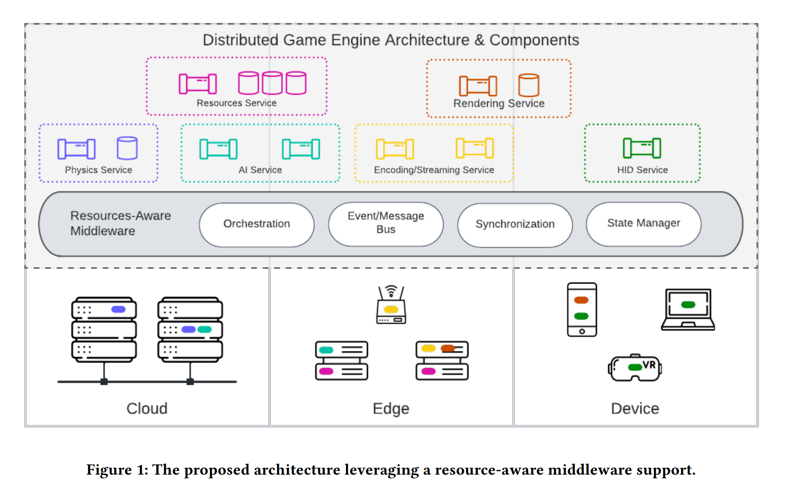
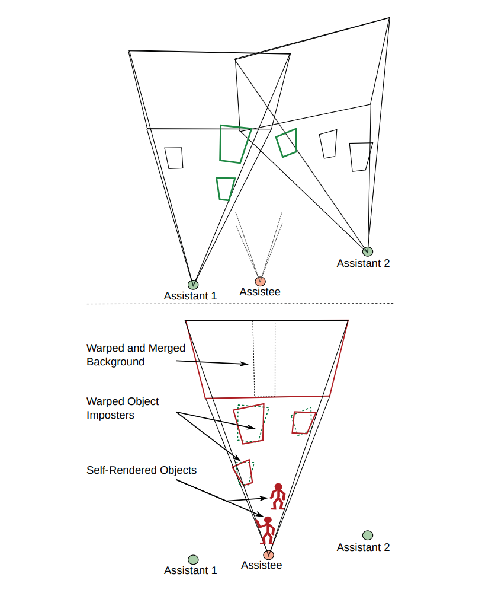

### DHR: Distributed Hybrid Rendering for Metaverse Experiences

[DHR: Distributed Hybrid Rendering for Metaverse Experiences](https://dl.acm.org/doi/10.1145/3552483.3556455)

- The client performs rasterization locally, while the server computes ray-traced shadows. The G-Buffer is computed locally, whereas the visibility buffer is computed on the server.
- The visibility buffer may experience some delays due to network latency. The thin client device utilizes motion vectors and the G-Buffer to locally predict the visibility buffer, with a maximum prediction capability of k frames. The value of k is specified manually.
- During the prediction process, camera motion can occasionally exceed the boundaries of the visibility buffer, making predictions impossible. To address this, the resolution of the visibility buffer is increased. For example, an image rendered at 1920 x 1080 might use a visibility buffer resolution of 1984 x 1116. This additional resolution is also specified manually.
- There is potential for further research by combining DLSS super-resolution and frame generation, utilizing machine learning to automatically identify parameters and achieve adaptive full dynamic performance.

### CloudyGame: Enabling cloud gaming on the edge with dynamic asset streaming and shared game instances

[CloudyGame: Enabling cloud gaming on the edge with dynamic asset streaming and shared game instances](https://link.springer.com/article/10.1007/s11042-020-09612-z)

- Currently, cloud gaming for single-player games involves creating virtual machine (VM) instances, which can lead to high resource consumption. Art assets and code are often stored redundantly in multiple VMs in memory. 
- By sharing VM instances, each player operates in their own unique world and context, enabling resource sharing. Additionally, dynamic bandwidth allocation is utilized, providing less bandwidth to players who are inactive and more to those actively engaged in areas of interest (AOI).
- The primary bottleneck in this system is the GPU, as multiple player instances share the same GPU resources. This issue could be alleviated through distributed rendering techniques.
- Shared instances allow for data sharing as well. For example, if one player is using a local desktop while another is playing via a mobile device in an ad hoc cloud environment, both can be situated in the same AOI. In this scenario, pre-calculated results processed on the desktop can be directly transmitted to the mobile player's device.

### Gamelets — Multiplayer mobile games with distributed micro-clouds

[Gamelets — Multiplayer mobile games with distributed micro-clouds](https://ieeexplore.ieee.org/document/6799051)

- The world is divided into blocks, with different gamelets representing each block, similar to the structure of online games. 
- In terms of distributed rendering, different gamelets handle the rendering of specific tiles to create a cohesive final image. This process requires support from RTSG (Ray Tracing for X3D via a Flexible Rendering Framework) or network-integrated multimedia middleware. For more details, refer to the pipeline framework.
- If Player A is in Area of Interest (AOI) A and Player B is in AOI B, and then Player A moves into AOI B while Player B enters AOI A, consider directly switching the rendering gamelet between A and B.

### Improving Cloud Gaming Experience through Mobile Edge Computing

[Improving Cloud Gaming Experience through Mobile Edge Computing](https://ieeexplore.ieee.org/document/8685768)

- Cloud servers are responsible for advanced user management, while edge servers run the actual games and client displays.

### A Cloud-Edge Collaborative Gaming Framework Using AI-Powered Foveated Rendering and Super Resolution

[A Cloud-Edge Collaborative Gaming Framework Using AI-Powered Foveated Rendering and Super Resolution](https://dl.acm.org/doi/10.4018/IJSWIS.321751)

- Cloud servers handle gaze point rendering, which involves high-resolution rendering of the area that the user is focusing on and low-resolution rendering of other areas. Edge servers perform super-resolution and then transmit the rendered content back to the client.

### A Cloud Gaming Framework for Dynamic Graphical Rendering Towards Achieving Distributed Game Engines

[A Cloud Gaming Framework for Dynamic Graphical Rendering Towards Achieving Distributed Game Engines](https://www.usenix.org/conference/hotcloud20/presentation/bulman)

- The general graphics API serves as an intermediary layer. The game communicates with this API, which then forwards calls to specific lower-level APIs such as OpenGL or Vulkan, facilitating easy hot switching between them. 
- The rendering process is separated from the game engine, allowing for interleaved server and local rendering. For instance, when network conditions are good, the server might render 40 frames while the local system renders 20 frames. Conversely, if the network connection is poor, all rendering is done locally. The ratio of server to local rendering can be manually specified and dynamically adjusted as needed. Importantly, the server's renderer can be shared by multiple game instances.

### Kahawai: High-Quality Mobile Gaming Using GPU Offload

[Kahawai: High-Quality Mobile Gaming Using GPU Offload](https://www.microsoft.com/en-us/research/publication/kahawai-high-quality-mobile-gaming-using-gpu-offload/)

- **Collaborative rendering** involves a client that renders low quality image while the server renders images at both high and low qualities. The server calculates the differences (delta) between the two images, compresses the data, and sends it to the client for decoding and application.
- Alternatively, the client renders high image quality at a low frame rate (the client renders I-frames, which are self-contained frames containing all information, and P-frames are relatively small and depend on previous frames). The server renders high quality image at a high frame rate (I-frames and P-frames). The client encodes the I-frames. The server replaces its own I-frames with empty frames, compresses them, and sends this data to the client for merging and display.

### Outatime: Using Speculation to Enable Low-Latency Continuous Interaction for Cloud Gaming

[Outatime: Using Speculation to Enable Low-Latency Continuous Interaction for Cloud Gaming](https://www.microsoft.com/en-us/research/publication/outatime-using-speculation-to-enable-low-latency-continuous-interaction-for-mobile-cloud-gaming/)

- The system is capable of predicting a speculative frame that represents possible future outcomes, sending this frame to the client one round-trip time (RTT) in advance, and can quickly recover in case of errors.

### A Hybrid-Streaming Method for Cloud Gaming: To Improve the Graphics Quality delivered on Highly Accessible Game Contents

[A Hybrid-Streaming Method for Cloud Gaming: To Improve the Graphics Quality delivered on Highly Accessible Game Contents](https://www.semanticscholar.org/paper/A-Hybrid-Streaming-Method-for-Cloud-Gaming%3A-To-the-Chan-Ichikawa/29cdc30b449d95c0c1e1d6421880bde09dd5c94a)

- Combining image-based and instruction-based methods, objects are categorized into two groups: those that are close to the player and those that are far away.
- The server handling the distant objects rendering and streams the results, while it sends rendering instructions to the local devices for rendering objects that are close to the player.
- The client then overlays the results on the video stream from the server.

### Towards Scalable Cloud Gaming Systems: Decoupling Physics from the Game Engine

[Towards Scalable Cloud Gaming Systems: Decoupling Physics from the Game Engine](https://dl.acm.org/doi/10.1145/3631085.3631225)

- One virtual machine (VM) runs traditional cloud gaming using image-based methods, while another VM operates physics engines.
- The results indicate that there is not much difference in performance between the two approaches. Although the overall running time is shorter than that of single-machine, the order of magnitude of the frame times remain similar, and there's no significant advantage observed.

### Towards a Resource-aware Middleware Support for Distributed Game Engine Design

[Towards a Resource-aware Middleware Support for Distributed Game Engine Design](https://dl.acm.org/doi/10.1145/3524458.3547126)

### Towards Peer-Assisted Rendering in Networked Virtual Environments

[Towards Peer-Assisted Rendering in Networked Virtual Environments](https://dl.acm.org/doi/10.1145/2072298.2072324)

- Distant and static objects can be rendered on the cloud or a peer device, while dynamic objects are rendered locally. 
- Each server generates its own view and sends it to the client for synthesis.
- Alternatively, the server can render the entire panorama, allowing the client to synthesize it. 
- Additionally, the server can render views from a few fixed points, which the client can then synthesize.
- Powerful peer devices can render their own views and send them to a thin client for synthesis.
- All methods utilize image warping. Can we now consider the use of neural rendering?

### Virtualized Infrastructure for Video Game Applications in Cloud Environments

[Virtualized Infrastructure for Video Game Applications in Cloud Environments](https://dl.acm.org/doi/10.1145/2642668.2642679)

- (Marked)

### Aura Projection for Scalable Real-Time Physics

[Aura Projection for Scalable Real-Time Physics](https://dl.acm.org/doi/10.1145/3306131.3317021)

- Take out the physical module separately and partition the world so that each server manages its assigned area, handling physical simulation within that space. 

### CloudHide: Towards Latency Hiding Techniques for Thin-client Cloud Gaming

[CloudHide: Towards Latency Hiding Techniques for Thin-client Cloud Gaming](https://dl.acm.org/doi/10.1145/3126686.3126777)

- The server predicts the future frames and sends them to the client in advance.
- Exploring the possibility of integrating multi-view or neural rendering.

### SMASH: A distributed game engine architecture

[SMASH: A distributed game engine architecture](https://ieeexplore.ieee.org/document/7543739)

- The engine is organized into different modules that interact through a bus, similar to a microkernel and plug-in design.

### Revamping Cloud Gaming With Distributed Engines

[Revamping Cloud Gaming With Distributed Engines](https://ieeexplore.ieee.org/document/9767695)

- The game consists of various modules, where the data flow follows this sequence: user input → gameplay module → physics → rendering → display.
- Each module can be distributed across devices, including cloud or edge devices, based on its computational and latency requirements.

### Cloud Baking: Collaborative Scene Illumination for Dynamic Web3D Scenes

[Cloud Baking: Collaborative Scene Illumination for Dynamic Web3D Scenes](https://dl.acm.org/doi/abs/10.1145/3206431)

- Cloud server handles global illumination (GI), while local computing computes ambient light, then mix.
- 3D warping is employed to predict GI, which helps to reduce latency.
- The server can compute GI at lower frame rates.

### A novel cloud gaming framework using joint video and graphics streaming

[A novel cloud gaming framework using joint video and graphics streaming](https://ieeexplore.ieee.org/document/6890204)

- (Marked)

### Using Graphics Rendering Contexts to Enhance the Real-Time Video Coding for Mobile Cloud Gaming

[Using Graphics Rendering Contexts to Enhance the Real-Time Video Coding for Mobile Cloud Gaming](https://dl.acm.org/doi/10.1145/2072298.2072313)

- Render the sequence, select keyframes, and remove other frames.
- intermediate frames use 3D warping to interpolate and then encode keyframes and residual frames.

### Mobile Collaborative Walkthrough Using 3D Image Warping and Streaming

[Mobile Collaborative Walkthrough Using 3D Image Warping and Streaming](https://ieeexplore.ieee.org/document/1372417)

- The server renders the 3D model and transmits an initial depth image comprising color and pixel depth information to a remote client. This is called an I-frame. 
- The client then requests to view the model from a position relatively close to the current viewpoint. The desired viewing coordinates and the reference viewing co-ordinates are sent to the server. Meanwhile the client performs the 3D image warping procedure on the reference image to create and display a series of intermediate frames, or B-frames. These frames are reconstructed using a fixed size integer splat.
- When the server receives the viewing parameters from the client it executes identical image warping and reconstruction. It also renders the 3D model to obtain an exact image. From the warped and exact images the server calculates a hole residual, or difference image on the holes. This data is sparse and can be packed and losslessly compressed into a file of small size.
- The server also compresses and transmits the depth data for each pixel. When the client receives the data from the server each residual pixel is added to the client's P-frame. In addition the corresponding depth information is added to the depth buffer. The client now has a new reference frame which it can use to calculate new P-frames.

### Post-Rendering 3D Image Warping: Visibility, Reconstruction, and Performance for Depth-Image Warping

[Post-Rendering 3D Image Warping: Visibility, Reconstruction, and Performance for Depth-Image Warping](https://www.semanticscholar.org/paper/Post-Rendering-3D-Image-Warping%3A-Visibility%2C-and-Bishop-Mark/157707cb0d7676296bb6e5bed34560578f7ceba7)

