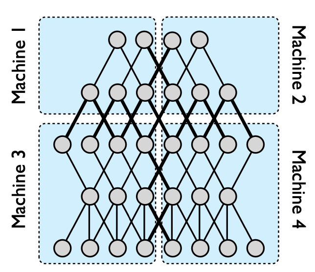
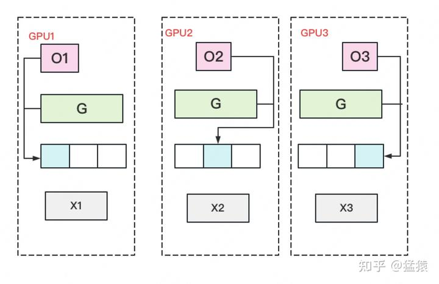

### Large Scale Distributed Deep Networks

[Large Scale Distributed Deep Networks](https://dl.acm.org/doi/10.5555/2999134.2999271)

- Only thick lines (interconnections on different machines) need to communicate, and even if there are multiple edges between two nodes, the status is only sent once.
- Models with a large number of parameters or high computational requirements typically benefit from using more CPU and memory until communication costs dominate.
- Models with locally connected structures are often more suitable for a wide distribution than fully connected structures because their communication requirements are lower.

- Downpour SGD
  - Divide the training data into several subsets (Data Shards) and run a copy of the model on each subset.
  - The model updates and communicates through a centralized parameter server, which maintains the current state of all model parameters distributed across many machines (for example, if we have 10 parameter server shards, each shard is responsible for storing and applying updates up to 1/10 of the model parameters).
  - In the simplest implementation, before processing each small batch, the model copy will request an updated copy of its model parameters from the parameter server. Because the DistBelief model itself is distributed across multiple machines, each machine only needs to communicate with a subset of the parameter server shards that store the model parameters related to its partition. After receiving an updated copy of its parameters, the DistBelief model copy processes a small batch of data to calculate parameter gradients and sends the gradients to the parameter server, which then applies the gradients to the current values of the model parameters.
  - By limiting each model copy to only request parameter updates at every n_fetch step and only sending updated gradient values at every n_push step (which may not be equal), the communication overhead of Downpour SGD can be reduced.

- The model replica is almost certainly based on a slightly outdated set of parameters to calculate its gradient, as during this period, other model replicas may have already updated the parameters on the parameter server.
- Due to the independent operation of parameter server shards, it cannot be guaranteed that at any given time, the parameters of each shard of the parameter server have undergone the same number of updates, or that the updates are applied in the same order.
- The use of Adagrad adaptive learning rate program can greatly improve the robustness of Downpour SGD. Adagrad does not use a single fixed learning rate on the parameter server (η in Figure 2), but instead uses a separate adaptive learning rate for each parameter.

- Sandblaster L-BFGS
  - The core of optimization algorithms (such as L-BFGS) is located in the coordinator process, which cannot directly access model parameters. On the contrary, the coordinator issues a small set of operation commands (such as dot product, scaling, coefficient addition, multiplication), and each parameter server shard can independently perform these operations, with the results stored on the same shard without sending all parameters and gradients to a single central server.
  - In a typical L-BFGS parallelization implementation, data is distributed across many machines, each responsible for calculating the gradient of a specific dataset. The gradient is sent back to the central server (or aggregated through tree). Many of these methods are waiting for the slowest machine, resulting in poor scalability on large shared clusters.
  - To address this issue, we adopted the following load balancing scheme: the coordinator allocates a small portion of work to each of the N model replicas, which is much smaller than 1/N of the total batch size, and allocates new portions to the replicas when they are idle. Through this method, faster model replicas do more work than slower replicas. In order to further manage slow model replicas at the end of batch processing, the coordinator arranges multiple replicas of unfinished parts and uses the results of the first completed model replica.
  - Compared to Downpour SGD, which requires relatively high frequency and bandwidth for parameter synchronization with parameter servers, Sandblast workers only retrieve parameters at the beginning of each batch (when the coordinator updates parameters) and send the completed gradient portion every few times (to prevent replica failures and restarts)

### GPipe: Efficient Training of Giant Neural Networks using Pipeline Parallelism

[GPipe: Efficient Training of Giant Neural Networks using Pipeline Parallelism](https://arxiv.org/abs/1811.06965)

- Not applicable to graph neural networks.
- A neural network can be defined as a sequence of L layers, each layer corresponding to a forward calculation function f_i and a set of parameters w_i.
- Gpip allows users to specify (optional) the computational cost c_i for each layer, and to divide the network into K blocks, that is, L layers are divided into K subsequences, each subsequence is called a cell, and then the kth block is placed on the kth GPU.
- But it will generate a lot of bubbles, and the solution is similar to data parallelism, cutting the data apart.
- The mini batch is further divided into M micro batches, and gradients are applied to each micro batch. The overall idea is similar to fine-grained multithreading.
- There is no dependency between micro batches, so after GPU 0 completes the first few layers, let GPU 1 calculate the later layers, and then GPU 0 simultaneously calculates the first few layers of the next micro batch.

- The intermediate result/activation function result (z=wx) is related to the width of the hidden layer and the size of the sample size: O (n * d * l), n: size of mini batch, d:  Width, l:  Number of layers.
- Re-materialization / Active checkpoint: Each accelerator only maintains one cell and only stores the activation at the boundary, which is the input of each cell. N is the size of the sample size (input of each cell), L/K is how many layers each cell has, n/m is the size used for a micro batch in the current training process, and (L/K) * (N/M) is the memory used for intermediate values in the calculation process of each cell.
- Bubble gap time: O((k-1) / (m+k-1)) , k:  Pipeline length, how many GPUs, m:  Instruction length, how many micro batches.
- The longer the instruction length, the lower the cost. When is it cost-effective M >= 4k.
- The recalculation of the backward stage can start earlier without waiting for the gradient of the previous layer to return.
- Low communication overhead because only activation tensors are sent at the partition boundaries between accelerators.
- To ensure efficiency, partitioning requires that each GPU has a similar load, otherwise some GPUs are calculating while others are idle. Therefore, optimization is based on the previous user input c_i, or the model is run once to collect data for optimization.

### Megatron-LM: Training Multi-Billion Parameter Language Models Using Model Parallelism

[Megatron-LM: Training Multi-Billion Parameter Language Models Using Model Parallelism](https://arxiv.org/abs/1909.08053)

- 

### Scaling Distributed Machine Learning with the Parameter Server

[Scaling Distributed Machine Learning with the Parameter Server](https://dl.acm.org/doi/10.5555/2685048.2685095)

- Multiple Work Groups: Different tasks can be run simultaneously, such as training and online inference. The server just needs to have proper parameter version control.
- (Key, Value): Key: A value derived from the hash of the index of w. Value: A scalar or a vector (e.g., the weight w).
- Range-based Push and Pull: Specify an upper bound and a lower bound, and perform batched sending and receiving of the entire segment within that range.

- Asynchronous Execution and Synchronization:

- Consistency Model: Reduces waiting time and improves system performance, but it may slow down model convergence.

- User-defined Filter: Used to filter messages that need to be sent. Example: Significantly Modified Filter – Only items whose updates exceed a certain threshold will be sent.
- Vector Clock: The total parameter count multiplied by the total number of nodes results in a large size. Since key-value pairs are sent in ranges, it is sufficient to record the timestamp for each segment, which significantly reducing storage requirements.
- Communication: The server computes a hash for all keys. The client sends the hash of the keys it intends to transmit to the server. If the server finds a match, it can avoid resending the keys.
- Consistent Hashing:
  - All keys are organized into a ring, and segments are randomly inserted. Each segment is maintained by a server node (responsible for that range of keys). However, the keys from the next two segments are also backed up. This ensures that the system can tolerate the failure of up to two nodes during training. Nodes can be added or removed dynamically during runtime.

  

  - Consistency Guarantee: A worker sends parameters to Server1. After performing the operation, Server1 backs up the result to Server2. Server2 sends an acknowledgment (ack) back to Server1. Server1 then sends an ack to the worker.
  - Bandwidth Optimization: Server1 aggregates values from all workers first, then backs up the aggregated result to Server2. This reduces bandwidth usage but increases latency.
- Worker Fault Tolerance: If the scheduler detects that a worker has failed, it reassigns the task to another worker or requests a new worker. Since no state is saved, the failure of a worker is not a critical issue.

### ZeRO: Memory Optimizations toward Training Trillion Parameter Models

[ZeRO: Memory Optimizations toward Training Trillion Parameter Models](https://arxiv.org/abs/1910.02054)

- Model states: model parameters (fp16), gradients (fp16), and Adam states (fp32 parameter backup, fp32 momentum and fp32 variance). Assuming model parameters is Φ, the total memory requirement is: 2Φ + 2Φ + (4Φ + 4Φ + 4Φ) = 16Φ B. The Adam states accounts for 75%.
- Residual states: Memory usage other than model states, including activation, temporary buffers and unusable video memory fragmentation.
- Optimizing model states (removing redundancy), ZeRO uses partitioning, which means that each card only stores 1 / N of the model state, so that only one model state is maintained in the system.
- ZERO-1 (partition Adam states P_os (optimizer states)):
  - parameters and gradients are still kept one copy per card.
  - the required video memory for the model state of each card is (4Φ + 12Φ / N) B. When N is relatively large, it tends to be 4Φ B, which is the (1/4) of the original 16Φ B.

  

  - A complete copy of parameter W is stored on each GPU. A batch of data is divided into 3 parts, each GPU gets one part, and after completing a round of foward and backward, each gets a part of gradient.
  - Perform AllReduce on the gradient to obtain the complete gradient G, generating a communication volume of 2Φ per GPU.
  - Once the complete gradient G is obtained, W can be updated. We know that the update of W is determined by both optimizer states and gradients. Due to only storing a portion of optimizer states on each GPU, only the corresponding W (blue part) can be updated. (2) (3) can be represented by the following image:

  

  - At this point, there are some W on each GPU that have not completed the update (the white part in the image). So we need to do an AllGather on W and retrieve the updated parts of W from other GPUs. Generate Φ communication volume per GPU.

- ZERO-2 (partition Adam states and gradients P_os+g):
  - The model parameters are still kept one copy per gpu.
  - The memory requirement of each GPU is: (2Φ + (2Φ + 12Φ) / N) B. When N is large, it tends to be 2Φ B, which is the (1/8) of the original 16Φ B.

  

  - A complete copy of parameter W is stored on each GPU. A batch of data is divided into 3 parts, each GPU gets one part, and after completing a round of foward and backward, each gets a part of gradient with complete size (green + white in the image below).
  - Perform a Reduce Scatter on the gradient to ensure that the gradient maintained on each GPU is an aggregated gradient. For example, for GPU1, it is responsible for maintaining G1, so other GPUs only need to send the gradient at the corresponding position of G1 to GPU1 for summation. After the summary is completed, the white blocks are useless to the GPU and can be removed from the video memory. Communication volume of per GPU is Φ.

  

  - Each GPU updates its corresponding W with its own corresponding O and G. After the update is completed, each GPU maintains a part of the updated W. Perform an AllGather on W to synchronize the updated W from other GPUs. Communication volume of per GPU is Φ.
  - Compared to plain DP, the storage has been reduced by 8 times, and the communication volume of for per GPU remains the same.
  - To make this more efficient in practice, we use a bucketization strategy, where we bucketize all the gradients corresponding to a particular partition, and perform reduction on the entire bucket at once.
- ZERO-3 (partition Adam states and gradients parameters and  P_os+g+p):

  

  - Only a portion of parameter W is saved on each GPU. Divide a batch of data into three parts, with each GPU getting one part.
  - When doing forward, perform an AllGather on W to retrieve W distributed on other GPUs to obtain a complete W. Communication volume of per GPU is Φ. After completing the forward, immediately discard the W that was not maintained by itself.
  - When doing the backward, perform an AllGather on W to retrieve the complete W. Communication volume of per GPU is Φ. After completing the backward, immediately discard the W that was not maintained by itself.
  - After completing the backward, obtain a gradient G of complete size, perform a Reduce-Scatter on G, and aggregate the its part of gradient maintained by itself from other GPUs. Communication volume of per GPU is Φ. After the aggregation operation is completed, immediately discard the G that is not maintained by itself.
  - Update W using self-maintained O and G. Since only a portion of W is maintained, there is no need to perform any AllReduce operations on W.
- ZERO-R:
  - P_a: Partitioned Activation Checkpointing
    - Previously, all activations were discarded after calculations were completed. Trade calculations for space. Now, some activations are discarded, and each GPU maintains one activation block. When needed, they are aggregated from other GPUs. Trade bandwidth for space.
    - This is aimed at the collaborative usage of MP (Model Parallelism) in Megatron. Megatron requires each GPU to hold a complete piece of X, while P_a only keeps a portion of X on each GPU. During computation, the missing parts are aggregated as needed. After computation, each GPU holds a complete-sized Y, but only half of the results. Typically, an all-reduce operation would be performed, but since each GPU now only maintains a portion, the all-reduce is only performed for the portion each GPU maintains.
  - C_B: Constant Size Buffer
    - Allocate a fixed-size buffer. The classic approach is to allocate a buffer and wait until it is completely filled before sending the data out. Alternatively, a delay limit can be set, such as waiting for more than 1 microsecond. Even if the buffer is not fully filled, the data is sent out, and the buffer size is dynamically adjusted. If the buffer is frequently filled, it is expanded; if it is often not filled, it is reduced.
  - M_D: Memory Defragmentation

### PipeDream: Generalized Pipeline Parallelism for DNN Training

[PipeDream: Generalized Pipeline Parallelism for DNN Training](https://arxiv.org/abs/1806.03377)

- 

### Mesh-TensorFlow: Deep Learning for Supercomputers

[Mesh-TensorFlow: Deep Learning for Supercomputers](https://arxiv.org/abs/1811.02084)

- 

### Using DeepSpeed and Megatron to Train Megatron-Turing NLG 530B, A Large-Scale Generative Language Model

[Using DeepSpeed and Megatron to Train Megatron-Turing NLG 530B, A Large-Scale Generative Language Model](https://arxiv.org/abs/2201.11990)

- 

### Galvatron: Efficient Transformer Training over Multiple GPUs Using Automatic Parallelism

[Galvatron: Efficient Transformer Training over Multiple GPUs Using Automatic Parallelism](https://arxiv.org/abs/2211.13878)

- 

### GShard: Scaling Giant Models with Conditional Computation and Automatic Sharding

[GShard: Scaling Giant Models with Conditional Computation and Automatic Sharding](https://arxiv.org/abs/2006.16668)

- 

### Beyond Data and Model Parallelism for Deep Neural Networks

[Beyond Data and Model Parallelism for Deep Neural Networks](https://arxiv.org/abs/1807.05358)

- 

### Efficient Large-Scale Language Model Training on GPU Clusters Using Megatron-LM

[Efficient Large-Scale Language Model Training on GPU Clusters Using Megatron-LM](https://arxiv.org/abs/2104.04473)

- 

### Accelerating Training of Transformer-Based Language Models with Progressive Layer Dropping

[Accelerating Training of Transformer-Based Language Models with Progressive Layer Dropping](https://arxiv.org/abs/2010.13369)

- 

### Large-Scale Deep Unsupervised Learning Using Graphics Processors

[Large-Scale Deep Unsupervised Learning Using Graphics Processors](https://dl.acm.org/doi/10.1145/1553374.1553486)

- 

### DeepSpeed Inference: Enabling Efficient Inference of Transformer Models at Unprecedented Scale

[DeepSpeed Inference: Enabling Efficient Inference of Transformer Models at Unprecedented Scale](https://arxiv.org/abs/2207.00032)

- 